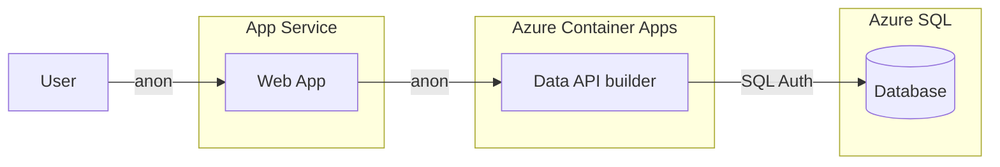
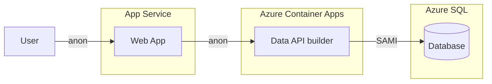
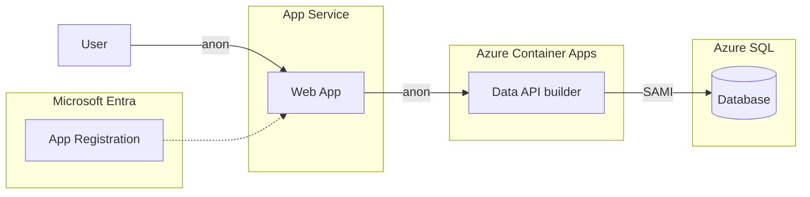
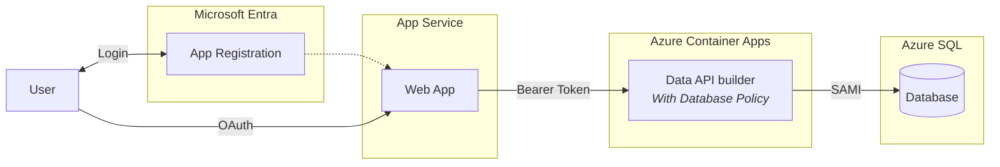
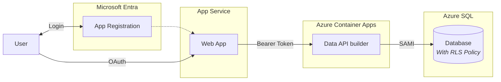

# Data API Builder Quickstarts

Five progressive quickstarts that walk from anonymous access to full row-level enforcement in Azure SQL. Each quickstart is self-contained and can run independently. The architecture evolves step by step, so you can see exactly what changes at each layer.

* [Quickstart 1](#quickstart-1-sql-authentication): Anonymous + SQL credentials
* [Quickstart 2](#quickstart-2-managed-identity): Anonymous + Managed Identity
* [Quickstart 3](#quickstart-3-securing-the-api): Token-secured API + Managed Identity
* [Quickstart 4](#quickstart-4-user-authentication-with-dab-policies): User authentication + DAB policy enforcement
* [Quickstart 5](#quickstart-5-row-level-security): User authentication + SQL Row-Level Security enforcement

Each step tightens identity and shifts enforcement closer to the data.

## Quickstart 1: SQL Authentication



Starting simple, the web app is anonymous and calls Data API builder without user identity. DAB connects to Azure SQL using SQL authentication with stored credentials.

This is the most basic configuration. It demonstrates the request flow and how DAB exposes database objects as REST or GraphQL endpoints.

> **Considerations on SQL Auth**:
> DAB stores a username and password in configuration to authenticate to the database. That works for development and learning, but it introduces credential management risk. In production, avoid embedding secrets when possible.

### Example SQL Auth connection string
```
    Server=tcp:myserver.database.windows.net,1433; 
    Initial Catalog=mydb; 
    User ID=myuser; 
    Password=mypassword; 
    TrustServerCertificate=True; 
```

## Quickstart 2: Managed Identity



Removing passwords, DAB now connects to Azure SQL using a System-Assigned Managed Identity (SAMI). The web app is still anonymous. The API authenticates to SQL using its Azure identity.

This eliminates stored database credentials and is the recommended baseline for production deployments.

> **Considerations on SAMI**:
> The API must run in an Azure environment that supports managed identities. Azure SQL must be configured to trust that identity. Once configured, no secrets are required in configuration.

### Example SAMI connection string
```
    Server=tcp:myserver.database.windows.net,1433; 
    Initial Catalog=mydb; 
    Authentication=Active Directory Managed Identity
    TrustServerCertificate=True; 
```

## Quickstart 3: Setting Up Entra ID



Introducing Entra ID on the API side. The web app is still fully anonymous — no login, no MSAL, identical to Quickstart 2 from the user's perspective. The change is behind the scenes: DAB is configured with an **EntraId** authentication provider and an **anonymous** role. An app registration is created for the API (audience + issuer), wiring up the auth infrastructure without requiring tokens.

This sets the stage for Quickstart 4, which adds login, bearer tokens, and per-user filtering.

> **Considerations on Auth Infrastructure**:
> The app registration and EntraId provider are in place, but the anonymous role means no token is required. This pattern lets you prepare auth infrastructure before enabling it — a common staging approach.

## Quickstart 4: User Authentication with DAB Policies



Adding per-user filtering, users still authenticate with Microsoft Entra ID. The web app sends a bearer token to DAB. DAB still connects to SQL using SAMI.

The difference in this quickstart is policy enforcement inside DAB. The API reads claims from the token and applies database policies to restrict what data a user can access.

> **Considerations on DAB Policy**:
> Identity now flows through the system. DAB enforces data access rules based on user claims. The database trusts DAB’s identity, but DAB is responsible for applying user-level filtering.

### Example DAB policy

To restrict access to rows where the OwnerId matches the user’s subject claim.

```json
{
  "entities": {
    "Todos": {
      "permissions": [
        {
          "role": "authenticated",
          "actions": [
            {
              "action": "read",
              "policy": {
                "database": "@item.Owner eq @claims.preferred_username"
              }
            }
          ]
        }
      ]
    }
  }
}
```

## Quickstart 5: Row-Level Security



Moving enforcement into the database, Azure SQL now implements Row-Level Security (RLS). The authentication flow is identical to Quickstart 4. What changes is where authorization happens.

Instead of DAB enforcing user-based filtering, SQL enforces it directly using RLS policies tied to the authenticated context.

> **Considerations on Row-Level Security**:
> RLS pushes access control into the database engine itself. Even if an API misconfigures filtering logic, the database enforces row-level restrictions. This is the most robust model because authorization is guaranteed at the data layer.

### Example RLS policy

To restrict access to rows where the OwnerId matches the database user.

```sql
CREATE FUNCTION dbo.UserFilterPredicate(@OwnerId sysname)
RETURNS TABLE
WITH SCHEMABINDING
AS  RETURN SELECT 1 AS IsVisible
WHERE @OwnerId = SUSER_SNAME(); 

CREATE SECURITY POLICY UserFilterPolicy
ADD FILTER PREDICATE dbo.UserFilterPredicate(OwnerId) ON dbo.YourTable
WITH (STATE = ON);
```

## License

Demonstration project for learning purposes.
