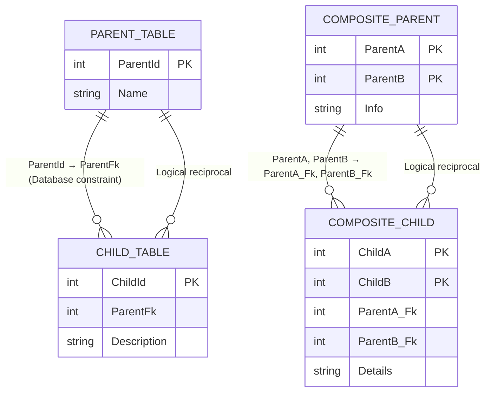

## What?

For auto-generated entities, add the option to create `one-to-many` and `many-to-one` cardinality relationships based on foreign key constraints defined in the database.

## Why?

Dynamic configurations already provide rich capabilities for REST endpoints. This feature allows those same configurations to provide richer GraphQL capabilities by enabling join operations across related entities.

## Configuration

```json
{
  "autoentities": {
    "catalog": {
      "patterns": { },
      "template": { },
      "permissions": [ ],
      "relationships": {
        "enabled": true,
        "name": {
          "relationship": "{source.object}_to_{target.object}",
          "reciprocal": "{target.object}_to_{source.object}"
        },
        "reciprocal": true
      }
    }
  }
}
```

| Property | Description                                                                                                                         |
| ---------------------- | ----------------------------------------------------------------------------------------------------------------------------------- |
| `enabled`                | (optional, default: true) Globally enable relationship creation for auto-generated entities.                                        |
| `name.relationship`      | (optional, default: `{source.object}_to_{target.object}`) Naming pattern for the relationship from source to target.                |
| `name.reciprocal`        | (optional, default: `{target.object}_to_{source.object}`) Naming pattern for the inverse relationship when `reciprocal` is enabled. |
| `reciprocal`             | (optional, default: true) Whether the inverse relationship should be generated automatically.                                       |

### Name placeholders

These placeholders may be used inside the relationship name patterns.

* `{entity}`: name of the entity
* `{source.schema}`: source table schema
* `{source.object}`: source table name
* `{target.schema}`: target table schema
* `{target.object}`: target table name
* `{constraint.name}`: foreign key constraint name

### Conditional relationship generation

Relationships are created only when both conditions are true:

* `runtime.graphql.enabled` = true
* `entities.<entity>.graphql.enabled` = true

If either condition is false, the relationship is skipped. No error is produced.

### How to recognize one-to-many in SQL Server

In SQL Server, a foreign key constraint represents a **many-to-one relationship** from the referencing table to the referenced table.

#### Example

```
Orders.ProductId → Products.ProductId
```

This indicates that many orders may reference a single product. The inverse direction can be exposed as a **one-to-many** relationship.

A **true one-to-one relationship** can only be inferred if the foreign key columns are also constrained by a unique index or unique constraint.



### How reciprocal relationships are handled

When `reciprocal` is true, DAB automatically creates the inverse relationship for each detected foreign key.

#### Example

Database constraint:

```
Orders.ProductId → Products.ProductId
```

Generated relationships:

```
Orders → Products (many-to-one)
Products → Orders (one-to-many)
```

If the database already contains a foreign key constraint in the opposite direction between the same tables, the metadata query detects it and marks the relationship as reciprocal so DAB does not generate duplicate relationships.

## Command Line

```
dab configure --autoentities.relationships.enabled true
dab configure --autoentities.relationships.name.relationship "xyz"
dab configure --autoentities.relationships.name.reciprocal "xyz"
dab configure --autoentities.relationships.reciprocal true
```

## Query to fetch metadata

This query returns all foreign key relationships between tables mapped to entities. It also detects reciprocal constraints and resolves relationship names using the configured naming patterns.

```sql
declare @entities nvarchar(max) =
'[
  { "entity": "Products", "schema": "dbo", "object": "Products" },
  { "entity": "Orders", "schema": "dbo", "object": "Orders" },
  { "entity": "Categories", "schema": "dbo", "object": "Categories" }
]';

declare @namePattern nvarchar(256) = '{entity}_{source.object}_to_{target.object}';
declare @reciprocalNamePattern nvarchar(256) = '{entity}_{target.object}_to_{source.object}';
declare @reciprocal bit = 1;

with entity_map as (
    select
        entity,
        schema_name,
        object_name
    from openjson(@entities)
    with (
        entity sysname '$.entity',
        schema_name sysname '$.schema',
        object_name sysname '$.object'
    )
),
fk as (
    select
        fk.object_id,
        constraintName = fk.name,

        parentSchema = s1.name,
        parentTable  = t1.name,

        childSchema  = s2.name,
        childTable   = t2.name,

        parentObjectId = fk.referenced_object_id,
        childObjectId  = fk.parent_object_id,

        sourceKeys =
            string_agg(c1.name, ',') within group (order by fkc.constraint_column_id),

        targetKeys =
            string_agg(c2.name, ',') within group (order by fkc.constraint_column_id)

    from sys.foreign_keys fk
    join sys.foreign_key_columns fkc
        on fk.object_id = fkc.constraint_object_id
    join sys.tables t1
        on fk.referenced_object_id = t1.object_id
    join sys.schemas s1
        on t1.schema_id = s1.schema_id
    join sys.tables t2
        on fk.parent_object_id = t2.object_id
    join sys.schemas s2
        on t2.schema_id = s2.schema_id
    join sys.columns c1
        on c1.object_id = fkc.referenced_object_id
       and c1.column_id = fkc.referenced_column_id
    join sys.columns c2
        on c2.object_id = fkc.parent_object_id
       and c2.column_id = fkc.parent_column_id
    group by
        fk.object_id,
        fk.name,
        s1.name, t1.name,
        s2.name, t2.name,
        fk.referenced_object_id,
        fk.parent_object_id
)

select
    sourceEntity = e1.entity,
    targetEntity = e2.entity,

    relationshipName =
        replace(
        replace(
        replace(
        replace(
        replace(
        replace(@namePattern,
            '{entity}', e1.entity),
            '{source.schema}', f.parentSchema),
            '{source.object}', f.parentTable),
            '{target.schema}', f.childSchema),
            '{target.object}', f.childTable),
            '{constraint.name}', f.constraintName),

    reciprocalRelationshipName =
        case
            when @reciprocal = 1 and r.object_id is null
        then
            replace(
            replace(
            replace(
            replace(
            replace(
            replace(@reciprocalNamePattern,
                '{entity}', e2.entity),
                '{source.schema}', f.parentSchema),
                '{source.object}', f.parentTable),
                '{target.schema}', f.childSchema),
                '{target.object}', f.childTable),
                '{constraint.name}', f.constraintName)
        end,

    is_reciprocal =
        case when r.object_id is not null then 1 else 0 end,

    f.sourceKeys,
    f.targetKeys

from fk f
join entity_map e1
    on e1.schema_name = f.parentSchema
   and e1.object_name = f.parentTable

join entity_map e2
    on e2.schema_name = f.childSchema
   and e2.object_name = f.childTable

left join fk r
    on r.parentObjectId = f.childObjectId
   and r.childObjectId  = f.parentObjectId

order by sourceEntity, targetEntity;
```

This query ensures that:

* Only tables present in the entity list are considered.
* Relationship keys are derived from the foreign key definition.
* Composite keys are supported.
* Reciprocal constraints are detected.
* Relationship names follow the configured naming pattern.
