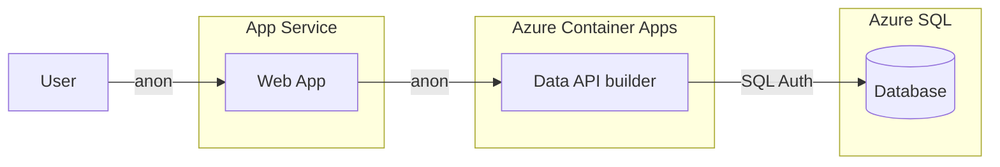
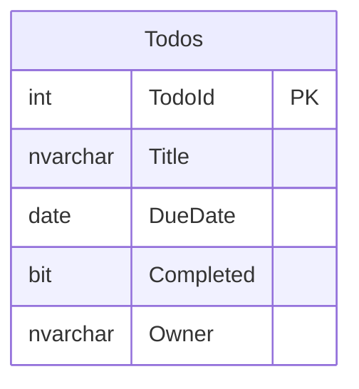

# Quickstart 1: SQL Authentication

Starting simple, the web app is anonymous and calls Data API builder without user identity. DAB connects to Azure SQL using SQL authentication with stored credentials.

This is the most basic configuration. It demonstrates the request flow and how DAB exposes database objects as REST or GraphQL endpoints.

## What You'll Learn

- Set up DAB with anonymous access
- Use .NET Aspire to orchestrate SQL Server + DAB locally
- Deploy to Azure with `azd up`

## Auth Matrix

| Hop | Auth |
|-----|------|
| User → Web | Anonymous |
| Web → API | Anonymous |
| API → SQL (local) | SQL Auth |
| API → SQL (Azure) | SQL Auth |

## Architecture



> **Considerations on SQL Auth**:
> DAB stores a username and password in configuration to authenticate to the database. That works for development and learning, but it introduces credential management risk. In production, avoid embedding secrets when possible.

### Example SQL Auth connection string
```
    Server=tcp:myserver.database.windows.net,1433; 
    Initial Catalog=mydb; 
    User ID=myuser; 
    Password=mypassword; 
    TrustServerCertificate=True; 
```

## Prerequisites

- [.NET 10+ SDK](https://dotnet.microsoft.com/download)
- [Aspire workload](https://learn.microsoft.com/dotnet/aspire/fundamentals/setup-tooling) — `dotnet workload install aspire`
- [Docker Desktop](https://www.docker.com/products/docker-desktop/)

> Run `dotnet tool restore` to install DAB from the included tool manifest.

## Run Locally

```bash
dotnet tool restore
aspire run
```

Aspire dashboard opens at `http://localhost:15888`. The web app is at `http://localhost:5173`.

## Deploy to Azure

```bash
azd auth login
azd up
```

This provisions Azure SQL, Container Apps (DAB + SQL Commander), and App Service (web).

## Database Schema



## Next Steps

- [Quickstart 2](../quickstart2/) — Replace SQL Auth with Managed Identity
- [Quickstart 3](../quickstart3/) — Set up Entra ID auth infrastructure on the API
- [Quickstart 4](../quickstart4/) — Add user login and per-user DAB policy filtering
- [Quickstart 5](../quickstart5/) — Move enforcement into SQL with Row-Level Security
