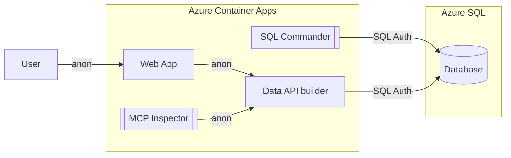
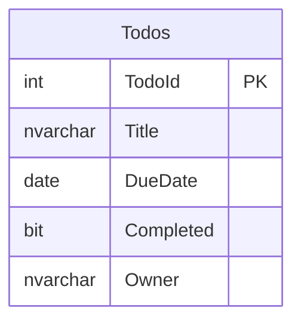

# Quickstart 1: SQL Authentication

Starting simple, the web app is anonymous and calls Data API builder without user identity. DAB connects to Azure SQL using SQL authentication with stored credentials.

This is the most basic configuration. It demonstrates the request flow and how DAB exposes database objects as REST or GraphQL endpoints.

## What You'll Learn

- Set up DAB with anonymous access
- Use .NET Aspire to orchestrate SQL Server + DAB locally
- Deploy to Azure with `azure-infra/azure-up.ps1`

## Auth Matrix

| Hop | Auth |
|-----|------|
| User → Web | Anonymous |
| Web → API | Anonymous |
| API → SQL (local) | SQL Auth |
| API → SQL (Azure) | SQL Auth |

## Architecture


```mermaid
flowchart LR
    U[User]

    subgraph Azure Container Apps
        W[Web App]
        A[Data API builder]
        M[[MCP Inspector]]
        C[[SQL Commander]]
    end

    subgraph Azure SQL
        S[(Database)]
    end

    U -->|anon| W
    W -->|anon| A
    M -->|anon| A
    C -->|SQL Auth| S
    A -->|SQL Auth| S
```

> **Considerations on SQL Auth**:
> DAB stores a username and password in configuration to authenticate to the database. That works for development and learning, but it introduces credential management risk. In production, avoid embedding secrets when possible.

### Example SQL Auth connection string
```
    Server=tcp:myserver.database.windows.net,1433; 
    Initial Catalog=mydb; 
    User ID=myuser; 
    Password=mypassword; 
    TrustServerCertificate=True; 
```

## Prerequisites

- [.NET 8 or later](https://dotnet.microsoft.com/download)
- [Aspire workload](https://learn.microsoft.com/dotnet/aspire/fundamentals/setup-tooling) — `dotnet workload install aspire`
- [Docker Desktop](https://www.docker.com/products/docker-desktop/)

> Run `dotnet tool restore` to install DAB from the included tool manifest.

## Run Locally

```bash
dotnet tool restore
dotnet run --project aspire-apphost
```

Aspire dashboard opens at `http://localhost:15888`. The web app is at `http://localhost:5173`.

## Deploy to Azure

```bash
pwsh ./azure-infra/azure-up.ps1
```

This provisions Azure SQL and Container Apps (DAB, SQL Commander, and web).

To tear down resources:

```bash
pwsh ./azure-infra/azure-down.ps1
```

## Database Schema


```mermaid
erDiagram
    Todos {
        int TodoId PK
        nvarchar Title
        date DueDate
        bit Completed
        nvarchar Owner
    }
```

## Related Quickstarts

| Quickstart | Inbound | Outbound | Security |
|------------|---------|----------|----------|
| **This repo** | Anonymous | SQL Auth | — |
| [Quickstart 2](https://github.com/Azure-Samples/dab-2.0-quickstart-web_anon-api_anon-db_entra) | Anonymous | Managed Identity | — |
| [Quickstart 3](https://github.com/Azure-Samples/dab-2.0-quickstart-web_anon-api_entra-db_entra) | Entra ID | Managed Identity | — |
| [Quickstart 4](https://github.com/Azure-Samples/dab-2.0-quickstart-web_entra-api_entra-db_entra-api_rls) | Entra ID | Managed Identity | API RLS |
| [Quickstart 5](https://github.com/Azure-Samples/dab-2.0-quickstart-web_entra-api_entra-db_entra-db_rls) | Entra ID | Managed Identity | DB RLS |
