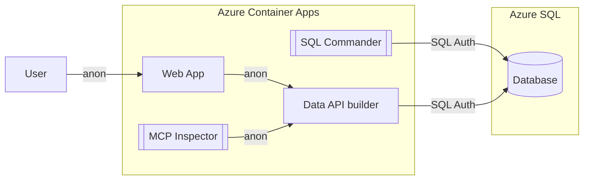
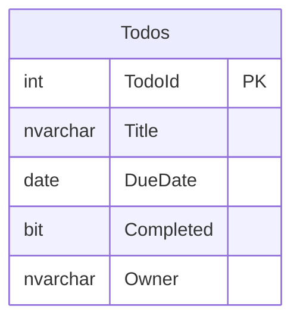

# Quickstart 1: SQL Authentication

Starting simple, the web app is anonymous and calls Data API builder without user identity. DAB connects to Azure SQL using SQL authentication with stored credentials.

This is the most basic configuration. It demonstrates the request flow and how DAB exposes database objects as REST or GraphQL endpoints.

## What You'll Learn

- Set up DAB with anonymous access
- Use .NET Aspire to orchestrate SQL Server + DAB locally
- Deploy to Azure with `azure-infra/azure-up.ps1`

## Auth Matrix

| Hop | Auth |
|-----|------|
| User → Web | Anonymous |
| Web → API | Anonymous |
| API → SQL (local) | SQL Auth |
| API → SQL (Azure) | SQL Auth |

## Architecture


```mermaid
flowchart LR
    U[User]

    subgraph Azure Container Apps
        W[Web App]
        A[Data API builder]
        M[[MCP Inspector]]
        C[[SQL Commander]]
    end

    subgraph Azure SQL
        S[(Database)]
    end

    U -->|anon| W
    W -->|anon| A
    M -->|anon| A
    C -->|SQL Auth| S
    A -->|SQL Auth| S
```

> **Considerations on SQL Auth**:
> DAB stores a username and password in configuration to authenticate to the database. That works for development and learning, but it introduces credential management risk. In production, avoid embedding secrets when possible.

### Example SQL Auth connection string
```
    Server=tcp:myserver.database.windows.net,1433; 
    Initial Catalog=mydb; 
    User ID=myuser; 
    Password=mypassword; 
    TrustServerCertificate=True; 
```

## Prerequisites

- [.NET 8 or later](https://dotnet.microsoft.com/download)
- [Aspire workload](https://learn.microsoft.com/dotnet/aspire/fundamentals/setup-tooling) — `dotnet workload install aspire`
- [Docker Desktop](https://www.docker.com/products/docker-desktop/)

> Run `dotnet tool restore` to install DAB from the included tool manifest.

## Run Locally

```bash
dotnet tool restore
dotnet run --project aspire-apphost
```

Aspire dashboard opens at `http://localhost:15888`. The web app is at `http://localhost:5173`.

## Deploy to Azure

```bash
pwsh ./azure-infra/azure-up.ps1
```

This provisions Azure SQL and Container Apps (DAB, SQL Commander, and web).

To tear down resources:

```bash
pwsh ./azure-infra/azure-down.ps1
```

## Database Schema

Note the `Owner` column in the `Todos` table. This will be important in later quickstarts when we add user identity and row-level security policies.


```mermaid
erDiagram
    Todos {
        int TodoId PK
        nvarchar Title
        date DueDate
        bit Completed
        nvarchar Owner
    }
```

## Recreate this quickstart with GitHub Copilot

Want to rebuild this quickstart from scratch with GitHub Copilot? Open a new empty folder in VS Code, switch GitHub Copilot to **agent mode**, and paste the prompt below. Copilot will collaborate with you to recreate the project end-to-end.

````
You are a senior developer pair-programming with me to recreate the **Quickstart 1: SQL Authentication** sample from the dab-quickstarts repo. Goal: build a working end-to-end demo locally with .NET Aspire and deploy it to Azure using Data API builder (DAB) as the API and MCP layer over SQL Server / Azure SQL, with **SQL Authentication** from DAB to the database.

## Repo conventions you must follow

- `azure-infra/` — Bicep + PowerShell deploy scripts (`azure-up.ps1`, `azure-down.ps1`, `post-provision.ps1`)
- `data-api/` — `dab-config.json` and `Dockerfile` for the DAB container
- `database/` — SQL Database Project (`database.sqlproj`, `Tables/`, `Scripts/PostDeployment.sql`)
- `web-app/` — static HTML/JS web app
- `aspire-apphost/` — .NET Aspire AppHost project
- `mcp-inspector/` — MCP Inspector container (Dockerfile, entrypoint.sh, nginx.conf)
- DAB is the only API/MCP layer for SQL — do not introduce a custom backend.

## Prerequisites — check silently first

Run version checks and only surface what is missing:
- `dotnet --version` (.NET 8+)
- `docker --version` (Docker Desktop running)
- `az --version` (Azure CLI, logged in via `az login`)
- `sqlpackage /version`
- `pwsh -v`
Install missing dotnet tools via `dotnet tool install -g` (for example `microsoft.sqlpackage`, `aspire.cli`). For Docker, point me to https://www.docker.com/products/docker-desktop/ and stop until I confirm.

## Collaborate with me before coding

Ask brief clarifying questions one at a time:
1. Azure subscription, region, and resource group name.
2. Sample schema (default: a small demo schema with seed data).
3. SQL admin **username** and confirm I want you to generate a strong **password** (alphanumeric plus `!@#%^&*`, **never** `$` — Docker Compose treats it as a variable).
4. Confirm I understand this will create **real, billable Azure resources** (Azure SQL, Container Apps, ACR, Log Analytics). Wait for an explicit "yes" before any `az` / `azd` command that creates resources.

## Show a visible todo list and keep it updated

Use a markdown checklist and re-print it after each major step:

```
- [ ] Prereqs verified
- [ ] Schema approved
- [ ] Database project created and built
- [ ] DAB config created with SQL Auth connection string
- [ ] Aspire AppHost wired up
- [ ] Local run validated
- [ ] Azure infra deployed
- [ ] DAB image built and pushed to ACR
- [ ] Container Apps live
- [ ] Validation evidence captured
- [ ] report.md written
```

## Build steps

1. **Database** — create `database/database.sqlproj` (SDK `Microsoft.Build.Sql/2.0.0`), `Tables/*.sql`, and `Scripts/PostDeployment.sql` with idempotent seed data. Build with `dotnet build database/database.sqlproj`.
2. **DAB** — create `data-api/dab-config.json` using the GA DAB image `mcr.microsoft.com/azure-databases/data-api-builder:latest`, with REST, GraphQL, and MCP enabled. Connection string uses **SQL Authentication**: `Server=...;Database=...;User ID=...;Password=@env('SQL_PASSWORD');TrustServerCertificate=True;Encrypt=True`. Entities exposed under the `anonymous` role with read permissions.
3. **DAB Dockerfile** — `data-api/Dockerfile` copies `dab-config.json` into the image (custom image pattern — **never** mount config from Azure Files or storage accounts).
4. **Aspire** — create `aspire-apphost/Aspire.AppHost.csproj` and `Program.cs` that orchestrates SQL Server, deploys the dacpac, then runs DAB, the web app, SQL Commander, and MCP Inspector with proper wait-for dependencies.
5. **Web app** — `web-app/index.html` + `app.js` + `dab.js` + `config.js`. No MSAL, no login. `dab.js` calls DAB anonymously.
6. **Auth wiring** — DAB authentication can remain at the default `StaticWebApps`/no-auth posture; entities exposed under `anonymous`. The credential surface is the DAB → SQL connection string, stored as `SQL_PASSWORD` in `.env` locally and as a Container App secret in Azure.

## Local validation

- Aspire dashboard at `http://localhost:15888` — every resource green.
- DAB health: `curl http://localhost:5000/health` returns healthy.
- REST: `GET /api/<Entity>` returns rows.
- GraphQL: a `{ <entity> { items { ... } } }` query returns rows.
- MCP: open MCP Inspector and successfully invoke a DAB MCP tool.
- SQL Commander: connect with the SQL Auth credentials and `SELECT` from a seeded table.
- Web app loads at `http://localhost:5173` and renders data anonymously.

## Azure deployment

Generate `azure-infra/main.bicep`, `resources.bicep`, `main.parameters.json`, and `azure-infra/azure-up.ps1` that:
- Creates RG, Log Analytics, Container Apps Environment, ACR, Azure SQL server + database.
- Sets the Azure SQL **SQL admin login + password** (the same credentials DAB will use).
- Builds and pushes the DAB image via `az acr build`.
- Deploys Container Apps for `web-app`, `data-api`, `mcp-inspector`, and `sql-commander`.
- Stores the SQL password as a Container App **secret** and references it from `DATABASE_CONNECTION_STRING`.
- Adds Azure SQL firewall rule to allow Azure services (or specific Container App outbound IP).

Print progress like `[1/8] Creating resource group...` after each step. On any failure, diagnose with `az` queries and retry — do not just hand back to me.

## Cloud validation

- DAB `/health` on the public FQDN returns healthy.
- Web app FQDN loads and shows data.
- REST and GraphQL respond from the FQDN.
- All Container Apps `Running` and `Healthy` per `az containerapp show`.
- SQL Commander connects to Azure SQL with `TrustServerCertificate=True`.
- Confirm the connection-string secret exists in the Container App and **never** print the password value.

## Troubleshooting playbook

- Container Apps logs: `az containerapp logs show -n <app> -g <rg> --tail 200`
- DAB startup errors → verify the secret reference and connection string format.
- SQL `Login failed` → verify SQL admin user/password and Azure SQL firewall rule.
- ACR pull failures → verify `--registry-server` and admin credentials or pull role.
Iterate until validation passes; do not give up after a single attempt.

## Secrets and safety

- Use a local `.env` file for any secret (`KEY=value`); reference in DAB with `@env('KEY')`.
- Ensure `.gitignore` includes `.env`, `**/bin`, `**/obj` **before** writing any secret.
- Never echo or commit secrets. Generated passwords must avoid `$`. Redact secrets in any output as `***redacted***`.
- For Azure, store the SQL password as a Container App secret (or Key Vault reference).

## Cleanup

When I say we are done, run `pwsh ./azure-infra/azure-down.ps1` to delete the resource group, and confirm deletion with `az group exists`.

## Final deliverable: `report.md`

When everything is green, write `report.md` at the quickstart root containing:
- **Summary** — what was built and the auth model (anonymous web → anonymous DAB → SQL Auth to Azure SQL).
- **Azure resources** — RG, SQL server + DB, ACR, Container Apps Environment, each Container App, Log Analytics, with names and regions.
- **URLs** — web app FQDN, DAB `/health`, DAB REST/GraphQL/MCP endpoints, SQL Commander, MCP Inspector, Azure portal deep link.
- **Auth mode** — SQL Authentication from DAB to Azure SQL; web and API anonymous.
- **Secrets handling** — where each secret lives (`.env` locally, Container App secret in Azure). Show keys only; values as `***redacted***`.
- **Validation evidence** — health response, sample REST/GraphQL output (no PII), MCP tool result, SQL Commander screenshot or query result.
- **Failures and manual steps** — anything that did not auto-succeed and how it was fixed.
- **Cleanup commands** — exact commands to fully tear down.
- **Next steps** — for example, "graduate to passwordless with System-Assigned Managed Identity (see Quickstart 2)".

Begin by greeting me and asking the first clarifying question.
````
