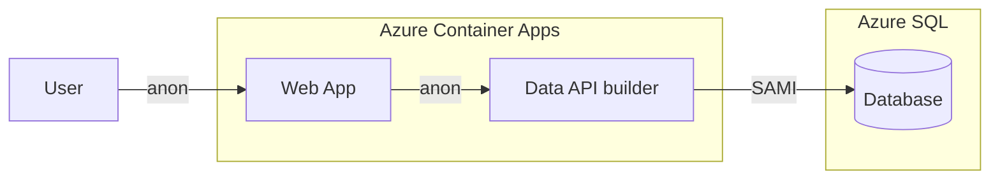

# Quickstart 2: Managed Identity

Builds on [Quickstart 1](../quickstart1/) by replacing SQL Auth with **System Assigned Managed Identity (SAMI)** for DAB → Azure SQL. The web app is still anonymous. The API authenticates to SQL using its Azure identity.

This eliminates stored database credentials and is the recommended baseline for production deployments.

## What You'll Learn

- Configure DAB with SAMI for passwordless Azure SQL access
- Set Entra admin on Azure SQL
- Create a database user from an external provider

## Auth Matrix

| Hop | Local | Azure |
|-----|-------|-------|
| User → Web | Anonymous | Anonymous |
| Web → API | Anonymous | Anonymous |
| API → SQL | SQL Auth | **SAMI** |

## Architecture



> **Considerations on SAMI**:
> The API must run in an Azure environment that supports managed identities. Azure SQL must be configured to trust that identity. Once configured, no secrets are required in configuration.

### Example SAMI connection string
```
    Server=tcp:myserver.database.windows.net,1433; 
    Initial Catalog=mydb; 
    Authentication=Active Directory Managed Identity
    TrustServerCertificate=True; 
```

## Prerequisites

- [.NET 10+ SDK](https://dotnet.microsoft.com/download)
- [Aspire workload](https://learn.microsoft.com/dotnet/aspire/fundamentals/setup-tooling) — `dotnet workload install aspire`
- [Docker Desktop](https://www.docker.com/products/docker-desktop/)

> Run `dotnet tool restore` to install DAB from the included tool manifest.

## Run Locally

```bash
dotnet tool restore
aspire run
```

Locally, DAB uses SQL Auth to talk to the containerized SQL Server — same as Quickstart 1.

## Deploy to Azure

```bash
pwsh ./azure-infra/azure-up.ps1
```

The post-provision script automatically:
1. Sets you as Entra admin on Azure SQL
2. Creates a database user for DAB's managed identity (`CREATE USER [name] FROM EXTERNAL PROVIDER`)
3. Grants `db_datareader` and `db_datawriter` roles

No passwords stored for DAB → Azure SQL.

To tear down resources:

```bash
pwsh ./azure-infra/azure-down.ps1
```

## What Changed from Quickstart 1

| File | Change |
|------|--------|
| `azure/resources.bicep` | DAB container gets `identity: { type: 'SystemAssigned' }` and uses MI connection string |
| `azure/main.bicep` | Outputs `AZURE_CONTAINER_APP_API_PRINCIPAL_ID` |
| `azure/post-provision.ps1` | Adds Entra admin + SAMI user creation steps |

## Related Quickstarts

| Quickstart | Inbound | Outbound | Security |
|------------|---------|----------|----------|
| [Quickstart 1](https://github.com/Azure-Samples/data-api-builder-2.x-sql-quickstart-01-inbound-anonymous-outbound-sql-auth) | Anonymous | SQL Auth | — |
| **This repo** | Anonymous | Managed Identity | — |
| [Quickstart 3](https://github.com/Azure-Samples/data-api-builder-2.x-sql-quickstart-03-inbound-entraid-outbound-managed-identity) | Entra ID | Managed Identity | — |
| [Quickstart 4](https://github.com/Azure-Samples/data-api-builder-2.x-sql-quickstart-04-inbound-entraid-outbound-managed-identity-api-rls) | Entra ID | Managed Identity | API RLS |
| [Quickstart 5](https://github.com/Azure-Samples/data-api-builder-2.x-sql-quickstart-05-inbound-entraid-outbound-managed-identity-db-rls) | Entra ID | Managed Identity | DB RLS |
