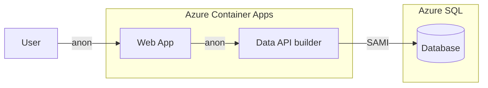

# Quickstart 2: Managed Identity

Uses **System Assigned Managed Identity (SAMI)** for DAB → Azure SQL. The web app is anonymous. The API authenticates to SQL using its Azure identity.

This eliminates stored database credentials and is the recommended baseline for production deployments.

## What You'll Learn

- Configure DAB with SAMI for passwordless Azure SQL access
- Set Entra admin on Azure SQL
- Create a database user from an external provider

## Auth Matrix

| Hop | Local | Azure |
|-----|-------|-------|
| User → Web | Anonymous | Anonymous |
| Web → API | Anonymous | Anonymous |
| API → SQL | SQL Auth | **SAMI** |

## Architecture


```mermaid
flowchart LR
    U[User]

    subgraph Azure Container Apps
        W[Web App]
        A[Data API builder]
    end

    subgraph Azure SQL
        S[(Database)]
    end

    U -->|anon| W
    W -->|anon| A
    A -->|SAMI| S
```

> **Considerations on SAMI**:
> The API must run in an Azure environment that supports managed identities. Azure SQL must be configured to trust that identity. Once configured, no secrets are required in configuration.

### Example SAMI connection string
```
    Server=tcp:myserver.database.windows.net,1433; 
    Initial Catalog=mydb; 
    Authentication=Active Directory Managed Identity
    TrustServerCertificate=True; 
```

## Prerequisites

- [.NET 8 or later](https://dotnet.microsoft.com/download)
- [Aspire workload](https://learn.microsoft.com/dotnet/aspire/fundamentals/setup-tooling) — `dotnet workload install aspire`
- [Docker Desktop](https://www.docker.com/products/docker-desktop/)

> Run `dotnet tool restore` to install DAB from the included tool manifest.

## Run Locally

```bash
dotnet tool restore
dotnet run --project aspire-apphost
```

Locally, DAB uses SQL Auth to talk to the containerized SQL Server.

## Deploy to Azure

```bash
pwsh ./azure-infra/azure-up.ps1
```

The post-provision script automatically:
1. Sets you as Entra admin on Azure SQL
2. Creates a database user for DAB's managed identity (`CREATE USER [name] FROM EXTERNAL PROVIDER`)
3. Grants `db_datareader` and `db_datawriter` roles

No passwords stored for DAB → Azure SQL.

To tear down resources:

```bash
pwsh ./azure-infra/azure-down.ps1
```

## Key Implementation Files

| File | Purpose |
|------|---------|
| `azure-infra/resources.bicep` | Configures the DAB container with `identity: { type: 'SystemAssigned' }` and MI connection string |
| `azure-infra/main.bicep` | Outputs `AZURE_CONTAINER_APP_API_PRINCIPAL_ID` |
| `azure-infra/post-provision.ps1` | Sets Entra admin and creates the SAMI database user |


## Recreate this quickstart with GitHub Copilot

Want to rebuild this quickstart from scratch with GitHub Copilot? Open a new empty folder in VS Code, switch GitHub Copilot to **agent mode**, and paste the prompt below. Copilot will collaborate with you to recreate the project end-to-end.

````
You are a senior developer pair-programming with me to recreate the **Quickstart 2: Passwordless SQL with System-Assigned Managed Identity (SAMI)** sample from the dab-quickstarts repo. Goal: build a working end-to-end demo locally with .NET Aspire and deploy it to Azure using Data API builder (DAB) as the API and MCP layer, where DAB connects to Azure SQL **without any password** using its System-Assigned Managed Identity.

## Repo conventions you must follow

- `azure-infra/` — Bicep + PowerShell deploy scripts (`azure-up.ps1`, `azure-down.ps1`, `post-provision.ps1`)
- `data-api/` — `dab-config.json` and `Dockerfile` for the DAB container
- `database/` — SQL Database Project (`database.sqlproj`, `Tables/`, `Scripts/PostDeployment.sql`)
- `web-app/` — static HTML/JS web app
- `aspire-apphost/` — .NET Aspire AppHost project
- `mcp-inspector/` — MCP Inspector container (Dockerfile, entrypoint.sh, nginx.conf)
- DAB is the only API/MCP layer for SQL — do not introduce a custom backend.

## Prerequisites — check silently first

Run version checks and only surface what is missing:
- `dotnet --version` (.NET 8+)
- `docker --version` (Docker Desktop running)
- `az --version` (Azure CLI, logged in via `az login`)
- `sqlpackage /version`
- `pwsh -v`
Install missing dotnet tools via `dotnet tool install -g` (for example `microsoft.sqlpackage`, `aspire.cli`). For Docker, point me to https://www.docker.com/products/docker-desktop/ and stop until I confirm.

## Collaborate with me before coding

Ask brief clarifying questions one at a time:
1. Azure subscription, region, and resource group name.
2. Sample schema (default: a small demo schema with seed data).
3. The Entra ID **AAD admin** for the Azure SQL server — a user UPN or a group (recommended) that you will set as SQL admin so post-provision can create the SAMI user.
4. Confirm I understand this will create **real, billable Azure resources** (Azure SQL, Container Apps, ACR, Log Analytics). Wait for an explicit "yes" before any `az` / `azd` command that creates resources.

## Show a visible todo list and keep it updated

Use a markdown checklist and re-print it after each major step:

```
- [ ] Prereqs verified
- [ ] Schema approved
- [ ] Database project created and built
- [ ] DAB config created with passwordless connection string
- [ ] Aspire AppHost wired up
- [ ] Local run validated (SQL Auth fallback acceptable locally)
- [ ] Azure infra deployed with System-Assigned Managed Identity enabled on DAB
- [ ] Entra admin set on Azure SQL
- [ ] SAMI created as a contained user in Azure SQL with role grants
- [ ] DAB image built and pushed to ACR
- [ ] Container Apps live and DAB authenticated via SAMI
- [ ] Validation evidence captured (no password anywhere in Azure)
- [ ] report.md written
```

## Build steps

1. **Database** — create `database/database.sqlproj` (SDK `Microsoft.Build.Sql/2.0.0`), `Tables/*.sql`, and `Scripts/PostDeployment.sql` with idempotent seed data. Build with `dotnet build database/database.sqlproj`.
2. **DAB** — `data-api/dab-config.json` uses the GA DAB image `mcr.microsoft.com/azure-databases/data-api-builder:latest`, with REST + GraphQL + MCP enabled. The **Azure** connection string is passwordless: `Server=tcp:<sqlserver>.database.windows.net,1433;Database=<db>;Authentication=Active Directory Default;Encrypt=True;TrustServerCertificate=False;`. **No `User ID` or `Password`** in the Azure config. Entities exposed under `anonymous` for this quickstart.
3. **DAB Dockerfile** — `data-api/Dockerfile` copies `dab-config.json` into the image (custom image pattern — **never** mount config from Azure Files).
4. **Aspire** — `aspire-apphost/Aspire.AppHost.csproj` and `Program.cs` orchestrate SQL Server locally, deploy the dacpac, and run DAB, the web app, SQL Commander, and MCP Inspector. (Local can use SQL Auth against the container; cloud must be passwordless.)
5. **Web app** — `web-app/index.html` + `app.js` + `dab.js` + `config.js`. No MSAL. Calls DAB anonymously.
6. **Auth wiring** —
   - `azure-infra/resources.bicep`: enable `identity: { type: 'SystemAssigned' }` on the DAB Container App. Output `AZURE_CONTAINER_APP_API_PRINCIPAL_ID`.
   - `azure-infra/post-provision.ps1`: set the configured user/group as the Azure SQL Entra admin, connect with `Invoke-Sqlcmd` using an AAD access token, and run `CREATE USER [<dab-app-name>] FROM EXTERNAL PROVIDER; ALTER ROLE db_datareader ADD MEMBER [<dab-app-name>]; ALTER ROLE db_datawriter ADD MEMBER [<dab-app-name>];` (use the Container App **name** — the SAMI display name).

## Local validation

- Aspire dashboard at `http://localhost:15888` — every resource green.
- DAB health: `curl http://localhost:5000/health` returns healthy.
- REST: `GET /api/<Entity>` returns rows.
- GraphQL: a `{ <entity> { items { ... } } }` query returns rows.
- MCP: open MCP Inspector and invoke a DAB MCP tool.
- SQL Commander: connect and `SELECT` from a seeded table.
- Web app loads at `http://localhost:5173` and renders data.

## Azure deployment

Generate `azure-infra/main.bicep`, `resources.bicep`, `main.parameters.json`, and `azure-infra/azure-up.ps1` that:
- Creates RG, Log Analytics, Container Apps Environment, ACR, Azure SQL server + database.
- Creates the DAB Container App with **System-Assigned Managed Identity**.
- Builds and pushes the DAB image via `az acr build`.
- Sets `DATABASE_CONNECTION_STRING` to the passwordless string above (plain env var, **no secret needed**).
- Deploys Container Apps for `web-app`, `mcp-inspector`, and `sql-commander`.
- Runs `post-provision.ps1` to set Entra admin and create the SAMI user.
- Adds SQL firewall rule for Azure services or for Container App outbound IPs.

Print progress like `[1/9] Creating resource group...` after each step. On any failure, diagnose with `az` queries and retry.

## Cloud validation

- DAB `/health` on the public FQDN returns healthy.
- Web app FQDN loads and shows data.
- REST and GraphQL respond from the FQDN.
- All Container Apps `Running` and `Healthy`.
- **Prove passwordless**: `az containerapp show` shows no SQL password secret on the DAB app; `DATABASE_CONNECTION_STRING` env var contains `Authentication=Active Directory Default` and **no `Password=`** substring.
- `az sql server ad-admin list` confirms Entra admin.
- A `SELECT SUSER_SNAME(), ORIGINAL_LOGIN()` via DAB-issued query (or via SQL Commander with your own AAD token) returns the DAB Container App name as the SQL user.

## Troubleshooting playbook

- Container Apps logs: `az containerapp logs show -n <app> -g <rg> --tail 200`
- `Login failed for user '<token-identified principal>'` → SAMI user not created or not in the right database. Re-run `post-provision.ps1`.
- DAB cannot acquire a token → confirm `identity.type = SystemAssigned` and that the Container App has been restarted after identity assignment.
- ACR pull failures → grant `AcrPull` to the Container App identity or use admin credentials.
Iterate until validation passes.

## Secrets and safety

- Local `.env` may contain a SQL password for the local SQL Server container only. Ensure `.gitignore` includes `.env`, `**/bin`, `**/obj` **before** writing any secret. Generated passwords must avoid `$`.
- In Azure, the win is **no SQL password exists at all**. Verify with the check above.
- Redact any secret in output as `***redacted***`.

## Cleanup

Run `pwsh ./azure-infra/azure-down.ps1` to delete the resource group; confirm with `az group exists`.

## Final deliverable: `report.md`

- **Summary** — what was built and the auth model (anonymous web → anonymous DAB → **SAMI passwordless** to Azure SQL).
- **Azure resources** — RG, SQL server + DB, ACR, Container Apps Environment, each Container App (note which has SAMI), Log Analytics, with names and regions.
- **URLs** — web app FQDN, DAB `/health`, REST/GraphQL/MCP endpoints, SQL Commander, MCP Inspector, Azure portal deep link.
- **Auth mode** — Passwordless via System-Assigned Managed Identity.
- **Secrets handling** — explicitly list what secrets do **not** exist in Azure for this quickstart (no SQL password, no SQL connection string secret). For anything that does exist, show keys only; values as `***redacted***`.
- **Validation evidence** — health response, REST/GraphQL sample, MCP tool result, the passwordless connection-string check, `SUSER_SNAME()` result proving SAMI identity.
- **Failures and manual steps** — anything that did not auto-succeed and how it was fixed (especially common: Entra admin not set, contained user missing).
- **Cleanup commands** — exact commands to fully tear down.
- **Next steps** — for example, "add an Entra ID auth provider for users (Quickstart 3) or full MSAL + per-user policies (Quickstart 4)".

Begin by greeting me and asking the first clarifying question.
````
