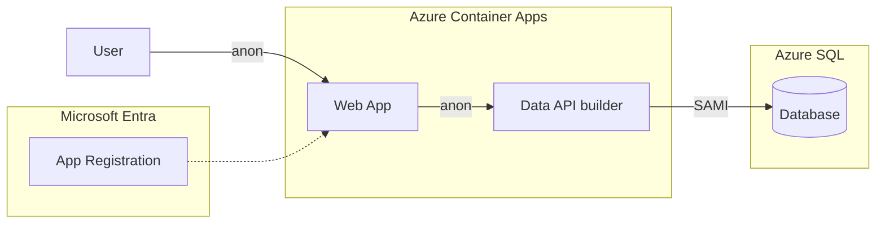

# Quickstart 3: Setting Up Entra ID

Builds on [Quickstart 2](../quickstart2/) by introducing **Microsoft Entra ID** as the authentication provider on the API. The web app remains fully anonymous — no login UI, no MSAL — identical to Quickstart 2 from the user's perspective.

The key change is on the API side: DAB is configured with an **EntraId** authentication provider and an **anonymous** role. An Entra ID app registration is created (audience + issuer), wiring up the auth infrastructure. Because the role is `anonymous`, the web app continues to work without bearer tokens.

This quickstart sets the stage for [Quickstart 4](../quickstart4/), which adds login, bearer tokens, and per-user filtering.

## What You'll Learn

- Register an app in Entra ID for the API
- Configure DAB with the EntraId provider and an `anonymous` role
- Wire up app registration (audience / issuer) without changing the web app
- Prepare the auth infrastructure before adding login

## Auth Matrix

| Hop | Local | Azure |
|-----|-------|-------|
| User → Web | Anonymous | Anonymous |
| Web → API | Anonymous | Anonymous |
| API → SQL | SQL Auth | **SAMI** |

> **Key point:** The API has an Entra ID provider, but the anonymous role allows unauthenticated requests. The web app is unchanged from Quickstart 2. Authentication infrastructure is wired — login is added in [Quickstart 4](../quickstart4/).

## Architecture



> **Considerations on Auth Infrastructure**:
> The app registration and EntraId provider are in place, but the anonymous role means no token is required. This pattern lets you prepare auth infrastructure before enabling it — a common staging approach.

## Prerequisites

- [.NET 10+ SDK](https://dotnet.microsoft.com/download)
- [Aspire workload](https://learn.microsoft.com/dotnet/aspire/fundamentals/setup-tooling) — `dotnet workload install aspire`
- [Azure CLI](https://docs.microsoft.com/cli/azure/install-azure-cli) (for Entra ID setup)
- [Data API Builder CLI](https://learn.microsoft.com/azure/data-api-builder/) — `dotnet tool restore`
- [Docker Desktop](https://www.docker.com/products/docker-desktop/)
- [PowerShell](https://learn.microsoft.com/powershell/scripting/install/installing-powershell)

**Azure Permissions Required:** Create app registrations in Entra ID.

## Run Locally

```bash
dotnet tool restore
az login
aspire run
```

On first run, Aspire detects that Entra ID isn't configured and offers to run `azure/entra-setup.ps1` interactively. This creates the app registration, updates `dab-config.json` with the audience and issuer, then starts normally.

The web app loads anonymously. There is no login — the user experience is identical to Quickstart 2. Behind the scenes, DAB now has an EntraId provider configured.

## Deploy to Azure

```bash
pwsh ./azure-infra/azure-up.ps1
```

The `preprovision` hook runs `entra-setup.ps1` automatically. During teardown via `azure-down.ps1`, the `postdown` hook runs `entra-teardown.ps1` to delete the app registration.

## What Changed from Quickstart 2

| File | Change |
|------|--------|
| `api/dab-config.json` | Adds EntraId auth provider with audience/issuer; `anonymous` role |
| `Aspire.AppHost/Demo.cs` | Checks for Entra placeholders in dab-config, guides setup |
| `azure-infra/entra-setup.ps1` | Creates app registration + API scope |
| `azure-infra/entra-teardown.ps1` | Deletes app registration on `azure-down` |

To tear down resources:

```bash
pwsh ./azure-infra/azure-down.ps1
```

> The web files (`index.html`, `app.js`, `dab.js`, `config.js`) are identical to Quickstart 2. No MSAL, no login, no bearer tokens.

## Next Steps

- [Quickstart 4](../quickstart4/) — Add login, bearer tokens, and per-user filtering with DAB policies
- [Quickstart 5](../quickstart5/) — Move enforcement into SQL with Row-Level Security
