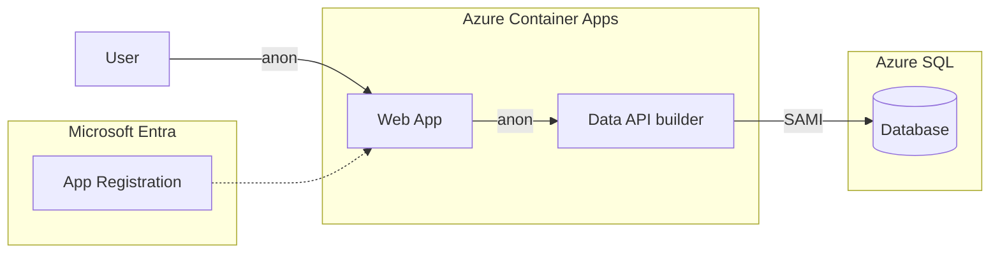

# Quickstart 3: Setting Up Entra ID

Introduces **Microsoft Entra ID** as the authentication provider on the API. The web app remains fully anonymous — no login UI and no MSAL in this quickstart.

The key change is on the API side: DAB is configured with an **EntraId** authentication provider and an **anonymous** role. An Entra ID app registration is created (audience + issuer), wiring up the auth infrastructure. Because the role is `anonymous`, the web app continues to work without bearer tokens.

This quickstart focuses on wiring authentication infrastructure at the API layer while keeping anonymous browser access.

## What You'll Learn

- Register an app in Entra ID for the API
- Configure DAB with the EntraId provider and an `anonymous` role
- Wire up app registration (audience / issuer) without changing the web app
- Prepare the auth infrastructure before adding login

## Auth Matrix

| Hop | Local | Azure |
|-----|-------|-------|
| User → Web | Anonymous | Anonymous |
| Web → API | Anonymous | Anonymous |
| API → SQL | SQL Auth | **SAMI** |

> **Key point:** The API has an Entra ID provider, but the anonymous role allows unauthenticated requests. Authentication infrastructure is present without requiring login in the browser.

## Architecture


```mermaid
flowchart LR
    U[User]

    subgraph Microsoft Entra
        E[App Registration]
    end

    subgraph Azure Container Apps
        W[Web App]
        A[Data API builder]
    end

    subgraph Azure SQL
        S[(Database)]
    end

    U -->|anon| W -->|anon| A
    E -.-> W
    A -->|SAMI| S
```

> **Considerations on Auth Infrastructure**:
> The app registration and EntraId provider are in place, but the anonymous role means no token is required. This pattern lets you prepare auth infrastructure before enabling it — a common staging approach.

## Prerequisites

- [.NET 8 or later](https://dotnet.microsoft.com/download)
- [Aspire workload](https://learn.microsoft.com/dotnet/aspire/fundamentals/setup-tooling) — `dotnet workload install aspire`
- [Azure CLI](https://docs.microsoft.com/cli/azure/install-azure-cli) (for Entra ID setup)
- [Data API Builder CLI](https://learn.microsoft.com/azure/data-api-builder/) — `dotnet tool restore`
- [Docker Desktop](https://www.docker.com/products/docker-desktop/)
- [PowerShell](https://learn.microsoft.com/powershell/scripting/install/installing-powershell)

**Azure Permissions Required:** Create app registrations in Entra ID.

## Run Locally

```bash
dotnet tool restore
az login
dotnet run --project aspire-apphost
```

On first run, Aspire detects that Entra ID isn't configured and offers to run `azure-infra/entra-setup.ps1` interactively. This creates the app registration, updates `dab-config.json` with the audience and issuer, then starts normally.

The web app loads anonymously with no login. Behind the scenes, DAB has an EntraId provider configured.

## Deploy to Azure

```bash
pwsh ./azure-infra/azure-up.ps1
```

The `preprovision` hook runs `entra-setup.ps1` automatically. During teardown via `azure-down.ps1`, the `postdown` hook runs `entra-teardown.ps1` to delete the app registration.

## Key Implementation Files

| File | Purpose |
|------|---------|
| `data-api/dab-config.json` | Defines EntraId auth provider with audience/issuer and `anonymous` role |
| `aspire-apphost/Demo.cs` | Checks for Entra placeholders in `dab-config.json` and guides setup |
| `azure-infra/entra-setup.ps1` | Creates app registration and API scope |
| `azure-infra/entra-teardown.ps1` | Deletes app registration on `azure-down` |

To tear down resources:

```bash
pwsh ./azure-infra/azure-down.ps1
```

> The web files (`index.html`, `app.js`, `dab.js`, `config.js`) stay anonymous in this quickstart. No MSAL, no login, and no bearer tokens are required in the browser.

## Recreate this quickstart with GitHub Copilot

Want to rebuild this quickstart from scratch with GitHub Copilot? Open a new empty folder in VS Code, switch GitHub Copilot to **agent mode**, and paste the prompt below. Copilot will collaborate with you to recreate the project end-to-end.

````
You are a senior developer pair-programming with me to recreate the **Quickstart 3: Entra ID provider with the anonymous role** sample from the dab-quickstarts repo. Goal: wire DAB to the Microsoft Entra ID authentication provider end-to-end (issuer, audience, app registration) while still exposing entities under the `anonymous` role. This is the infrastructure step before per-user policies and RLS in later quickstarts. The web app stays anonymous (no MSAL).

## Repo conventions you must follow

- `azure-infra/` — Bicep + PowerShell deploy scripts (`azure-up.ps1`, `azure-down.ps1`, `post-provision.ps1`); also `entra-up.ps1` / `entra-down.ps1` / `entra-setup.ps1` / `entra-teardown.ps1` for Entra app lifecycle.
- `data-api/` — `dab-config.json` and `Dockerfile` for the DAB container
- `database/` — SQL Database Project (`database.sqlproj`, `Tables/`, `Scripts/PostDeployment.sql`)
- `web-app/` — static HTML/JS web app (anonymous — no MSAL files)
- `aspire-apphost/` — .NET Aspire AppHost project
- `mcp-inspector/` — MCP Inspector container
- DAB is the only API/MCP layer for SQL — do not introduce a custom backend.

## Prerequisites — check silently first

- `dotnet --version` (.NET 8+)
- `docker --version` (Docker Desktop running)
- `az --version` (Azure CLI, logged in via `az login`)
- `sqlpackage /version`
- `pwsh -v`
- Microsoft Graph access via `az ad` commands (the signed-in user must be able to create app registrations, or I will provide a pre-created app).
Install missing dotnet tools via `dotnet tool install -g`. For Docker, point me to https://www.docker.com/products/docker-desktop/ and stop until I confirm.

## Collaborate with me before coding

Ask brief clarifying questions one at a time:
1. Azure subscription, region, and resource group name.
2. Sample schema (default: a small demo schema with seed data).
3. Entra tenant ID and whether to **create a new app registration** for the DAB API audience or reuse one I provide (app ID URI / audience and issuer URL).
4. Auth model on SQL side for DAB (passwordless via SAMI is recommended even though entities are still anonymous).
5. Confirm I understand this will create **real, billable Azure resources** (Azure SQL, Container Apps, ACR, Log Analytics) **and** an Entra app registration. Wait for an explicit "yes" before any create command.

## Show a visible todo list and keep it updated

```
- [ ] Prereqs verified
- [ ] Schema approved
- [ ] Database project created and built
- [ ] Entra app registration created (or reused) — audience + issuer captured
- [ ] DAB config created with EntraId provider; entities under anonymous role
- [ ] Aspire AppHost wired up
- [ ] Local run validated
- [ ] Azure infra deployed
- [ ] DAB image built and pushed to ACR
- [ ] Container Apps live
- [ ] Validation: anonymous works AND a bearer token is accepted as authenticated
- [ ] report.md written
```

## Build steps

1. **Database** — `database/database.sqlproj` (SDK `Microsoft.Build.Sql/2.0.0`), `Tables/*.sql`, and `Scripts/PostDeployment.sql` with idempotent seed data.
2. **Entra app** — `azure-infra/entra-up.ps1` creates an Entra application + service principal for the DAB API, exposes an Application ID URI (`api://<appId>`), and writes `ENTRA_AUDIENCE`, `ENTRA_ISSUER` (`https://login.microsoftonline.com/<tenantId>/v2.0`), and `ENTRA_TENANT_ID` into `.env`. `entra-down.ps1` deletes the app on teardown.
3. **DAB** — `data-api/dab-config.json` uses the GA DAB image `mcr.microsoft.com/azure-databases/data-api-builder:latest`. Configure:
   ```
   "authentication": {
     "provider": "EntraId",
     "jwt": { "audience": "@env('ENTRA_AUDIENCE')", "issuer": "@env('ENTRA_ISSUER')" }
   }
   ```
   Entities exposed under the `anonymous` role with read permissions; also list the `authenticated` role so signed-in calls are accepted.
4. **DAB Dockerfile** — `data-api/Dockerfile` copies `dab-config.json` into the image.
5. **Aspire** — `aspire-apphost/Aspire.AppHost.csproj` and `Program.cs` orchestrate SQL Server, deploy the dacpac, and run DAB, the web app, SQL Commander, and MCP Inspector, propagating Entra env vars to DAB.
6. **Web app** — `web-app/index.html` + `app.js` + `dab.js` + `config.js`. **Anonymous only** — explicitly **do not** add MSAL, login UI, or bearer tokens. Add a code comment noting that MSAL is introduced in Quickstart 4.
7. **DB auth from DAB** — use passwordless SAMI for the Azure path (re-use the Quickstart 2 pattern); SQL Auth is acceptable locally.

## Local validation

- Aspire dashboard at `http://localhost:15888` — every resource green.
- DAB health: `curl http://localhost:5000/health` returns healthy.
- REST: `GET /api/<Entity>` returns rows anonymously.
- GraphQL: a `{ <entity> { items { ... } } }` query returns rows anonymously.
- MCP: open MCP Inspector and invoke a DAB MCP tool.
- SQL Commander: connect and `SELECT` from a seeded table.
- Web app loads anonymously.
- Authenticated path proof: acquire an Entra token for the configured audience (e.g., `az account get-access-token --resource api://<appId>`) and call DAB with `Authorization: Bearer <token>` — request succeeds and DAB logs show the `authenticated` role was matched.

## Azure deployment

Generate `azure-infra/main.bicep`, `resources.bicep`, `main.parameters.json`, and `azure-infra/azure-up.ps1` that:
- Calls `entra-up.ps1` first (creates the app registration and writes `.env`).
- Creates RG, Log Analytics, Container Apps Environment, ACR, Azure SQL server + database.
- DAB Container App with **System-Assigned Managed Identity**.
- Builds and pushes the DAB image via `az acr build`.
- Deploys Container Apps for `web-app`, `data-api`, `mcp-inspector`, and `sql-commander`, propagating `ENTRA_AUDIENCE`, `ENTRA_ISSUER`, and `DATABASE_CONNECTION_STRING` (passwordless).
- Runs `post-provision.ps1` to set Entra admin and create the SAMI user in Azure SQL.

Print progress like `[1/10] Creating Entra app...` after each step. On any failure, diagnose with `az` queries and retry.

## Cloud validation

- DAB `/health` on the public FQDN returns healthy.
- Web app FQDN loads anonymously and shows data.
- Anonymous REST and GraphQL respond from the FQDN.
- A bearer token issued for `api://<appId>` is accepted by DAB and resolves to the `authenticated` role (capture a sample request/response with token redacted).
- All Container Apps `Running` and `Healthy`.

## Troubleshooting playbook

- `401 Unauthorized` with a valid token → audience mismatch. Double-check `aud` claim equals `ENTRA_AUDIENCE`.
- `IDX10501` / signing key errors → wrong issuer; use `https://login.microsoftonline.com/<tenantId>/v2.0`.
- DAB starts but ignores anonymous role → check that entity permissions list both `anonymous` and `authenticated` roles.
- Container Apps logs: `az containerapp logs show -n <app> -g <rg> --tail 200`.
Iterate until validation passes.

## Secrets and safety

- `.env` holds `ENTRA_TENANT_ID`, `ENTRA_AUDIENCE`, `ENTRA_ISSUER` and (locally) any SQL password. Ensure `.gitignore` includes `.env`, `**/bin`, `**/obj` **before** writing any secret. Generated passwords must avoid `$`.
- No client secret is required at this stage — the API only **validates** tokens, it does not call other APIs.
- Redact tokens and any secret as `***redacted***` in all output.

## Cleanup

Run `pwsh ./azure-infra/azure-down.ps1` to delete the resource group, then `pwsh ./azure-infra/entra-down.ps1` to delete the app registration. Confirm with `az group exists` and `az ad app list --display-name <name>`.

## Final deliverable: `report.md`

- **Summary** — what was built and the auth model (Entra ID provider wired up; entities still exposed as `anonymous`; foundation for Quickstart 4).
- **Azure resources** — RG, SQL server + DB, ACR, Container Apps Environment, each Container App (note SAMI), Log Analytics, plus the Entra app registration (app ID, audience, issuer) with names and regions.
- **URLs** — web app FQDN, DAB `/health`, REST/GraphQL/MCP endpoints, SQL Commander, MCP Inspector, Azure portal deep link, Entra portal link to the app registration.
- **Auth mode** — EntraId provider configured (audience + issuer); anonymous role active; authenticated role accepts valid tokens.
- **Secrets handling** — list `.env` keys (no values) and Container App env vars / secrets. Values shown as `***redacted***`.
- **Validation evidence** — health response, anonymous REST/GraphQL output, MCP tool result, **proof that a bearer token is accepted** (status code + redacted headers).
- **Failures and manual steps** — anything that did not auto-succeed and how it was fixed.
- **Cleanup commands** — exact commands including Entra teardown.
- **Next steps** — graduate to MSAL + per-user policies (Quickstart 4) or RLS (Quickstart 5).

Begin by greeting me and asking the first clarifying question.
````
