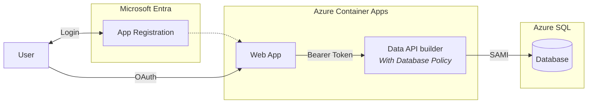

# Quickstart 4: User Authentication with DAB Policies

Builds on [Quickstart 3](../quickstart3/) by adding **DAB database policies** that filter data per user. Users authenticate with Microsoft Entra ID. The web app sends a bearer token to DAB. DAB still connects to SQL using SAMI.

The difference in this quickstart is policy enforcement inside DAB. The API reads claims from the token and applies database policies to restrict what data a user can access. Each authenticated user only sees their own todos.

## What You'll Learn

- Apply DAB database policies (`@item.Owner eq @claims.preferred_username`)
- Enforce per-user data isolation with zero custom API code
- Use MSAL in a SPA with auto-redirect (no manual login)
- Pass bearer tokens from web → API

## Auth Matrix

| Hop | Local | Azure |
|-----|-------|-------|
| User → Web | Entra ID (auto-redirect) | Entra ID (auto-redirect) |
| Web → API | Bearer token | Bearer token |
| API → SQL | SQL Auth + **policy** | SAMI + **policy** |

## Architecture



> **Considerations on DAB Policy**:
> Identity now flows through the system. DAB enforces data access rules based on user claims. The database trusts DAB's identity, but DAB is responsible for applying user-level filtering.

## Prerequisites

- [.NET 10+ SDK](https://dotnet.microsoft.com/download)
- [Aspire workload](https://learn.microsoft.com/dotnet/aspire/fundamentals/setup-tooling) — `dotnet workload install aspire`
- [Azure CLI](https://docs.microsoft.com/cli/azure/install-azure-cli) (for Entra ID setup)
- [Data API Builder CLI](https://learn.microsoft.com/azure/data-api-builder/) — `dotnet tool restore`
- [Docker Desktop](https://www.docker.com/products/docker-desktop/)
- [PowerShell](https://learn.microsoft.com/powershell/scripting/install/installing-powershell)

**Azure Permissions Required:** Create app registrations in Entra ID.

## Run Locally

```bash
dotnet tool restore
az login
aspire run
```

On first run, Aspire detects that Entra ID isn't configured and offers to run `azure/entra-setup.ps1` interactively. This creates the app registration, updates `config.js` and `dab-config.json`, then starts normally.

The web app auto-redirects to Microsoft login. Once signed in, all API calls include bearer tokens. Unlike Quickstart 3, each user now only sees rows they own.

## Deploy to Azure

```bash
azd auth login
azd up
```

The `preprovision` hook runs `entra-setup.ps1` automatically. After teardown, `azd down` runs `entra-teardown.ps1` to delete the app registration.

## The Policy

DAB applies this policy on every read, update, and delete:

```
@item.Owner eq @claims.preferred_username
```

This means the signed-in user can only access rows where `Owner` matches their Entra ID UPN. No custom API code required.

### Example DAB policy

To restrict access to rows where the Owner matches the user's subject claim:

```json
{
  "entities": {
    "Todos": {
      "permissions": [
        {
          "role": "authenticated",
          "actions": [
            {
              "action": "read",
              "policy": {
                "database": "@item.Owner eq @claims.preferred_username"
              }
            }
          ]
        }
      ]
    }
  }
}
```

## What Changed from Quickstart 3

| File | Change |
|------|--------|
| `api/dab-config.json` | Changes role from `anonymous` to `authenticated`; adds `policy` to read, update, and delete actions |
| `web/auth.js` | **New** — MSAL with auto-redirect (no manual login button) |
| `web/index.html` | Adds MSAL CDN, removes add-form (shows after auth), adds auth.js script |
| `web/app.js` | Adds `initializeApp()` async init with auth; `updateUI()` for signed-in state |
| `web/dab.js` | Sends bearer token with every API call via `getAuthHeaders()` |
| `web/config.js` | Adds `clientId` and `tenantId` for MSAL configuration |

> QS3 had no login at all — the web was fully anonymous. QS4 introduces the entire auth flow: MSAL, auto-redirect, bearer tokens, `authenticated` role, and per-user policies.

## Next Steps

- [Quickstart 5](../quickstart5/) — Move enforcement into SQL with Row-Level Security
