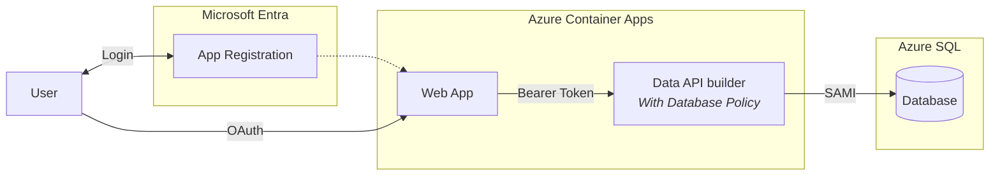

# Quickstart 4: User Authentication with DAB Policies

Adds **DAB database policies** that filter data per user. Users authenticate with Microsoft Entra ID. The web app sends a bearer token to DAB. DAB connects to SQL using SAMI.

The difference in this quickstart is policy enforcement inside DAB. The API reads claims from the token and applies database policies to restrict what data a user can access. Each authenticated user only sees their own todos.

## What You'll Learn

- Apply DAB database policies (`@item.Owner eq @claims.preferred_username`)
- Enforce per-user data isolation with zero custom API code
- Use MSAL in a SPA with auto-redirect (no manual login)
- Pass bearer tokens from web → API

## Auth Matrix

| Hop | Local | Azure |
|-----|-------|-------|
| User → Web | Entra ID (auto-redirect) | Entra ID (auto-redirect) |
| Web → API | Bearer token | Bearer token |
| API → SQL | SQL Auth + **policy** | SAMI + **policy** |

## Architecture


```mermaid
flowchart LR
    U[User]

    subgraph Microsoft Entra
        E[App Registration]
    end

    subgraph Azure Container Apps
        W[Web App]
        A[Data API builder<br/><i>With Database Policy</i>]
    end

    subgraph Azure SQL
        S[(Database)]
    end

    U <-->|Login| E
    E -.-> W
    U -->|OAuth| W -->|Bearer Token| A
    A -->|SAMI| S
```

> **Considerations on DAB Policy**:
> Identity now flows through the system. DAB enforces data access rules based on user claims. The database trusts DAB's identity, but DAB is responsible for applying user-level filtering.

## Prerequisites

- [.NET 8 or later](https://dotnet.microsoft.com/download)
- [Aspire workload](https://learn.microsoft.com/dotnet/aspire/fundamentals/setup-tooling) — `dotnet workload install aspire`
- [Azure CLI](https://docs.microsoft.com/cli/azure/install-azure-cli) (for Entra ID setup)
- [Data API Builder CLI](https://learn.microsoft.com/azure/data-api-builder/) — `dotnet tool restore`
- [Docker Desktop](https://www.docker.com/products/docker-desktop/)
- [PowerShell](https://learn.microsoft.com/powershell/scripting/install/installing-powershell)

**Azure Permissions Required:** Create app registrations in Entra ID.

## Run Locally

```bash
dotnet tool restore
az login
dotnet run --project aspire-apphost
```

On first run, Aspire detects that Entra ID isn't configured and offers to run `azure-infra/entra-setup.ps1` interactively. This creates the app registration, updates `config.js` and `dab-config.json`, then starts normally.

The web app auto-redirects to Microsoft login. Once signed in, all API calls include bearer tokens, and each user only sees rows they own.

## Deploy to Azure

```bash
pwsh ./azure-infra/azure-up.ps1
```

The `preprovision` hook runs `entra-setup.ps1` automatically. During teardown via `azure-down.ps1`, the `postdown` hook runs `entra-teardown.ps1` to delete the app registration.

To tear down resources:

```bash
pwsh ./azure-infra/azure-down.ps1
```

## The Policy

DAB applies this policy on every read, update, and delete:

```
@item.Owner eq @claims.preferred_username
```

This means the signed-in user can only access rows where `Owner` matches their Entra ID UPN. No custom API code required.

### Example DAB policy

To restrict access to rows where the Owner matches the user's subject claim:

```json
{
  "entities": {
    "Todos": {
      "permissions": [
        {
          "role": "authenticated",
          "actions": [
            {
              "action": "read",
              "policy": {
                "database": "@item.Owner eq @claims.preferred_username"
              }
            }
          ]
        }
      ]
    }
  }
}
```

## Key Implementation Files

| File | Purpose |
|------|---------|
| `data-api/dab-config.json` | Uses `authenticated` role and adds `policy` to read, update, and delete actions |
| `web-app/auth.js` | MSAL with auto-redirect (no manual login button) |
| `web-app/index.html` | Adds MSAL CDN, delays add-form display until auth, adds `auth.js` script |
| `web-app/app.js` | Uses `initializeApp()` async init with auth and `updateUI()` for signed-in state |
| `web-app/dab.js` | Sends bearer token with every API call via `getAuthHeaders()` |
| `web-app/config.js` | Defines `clientId` and `tenantId` for MSAL configuration |

> This quickstart includes the full auth flow: MSAL, auto-redirect, bearer tokens, `authenticated` role, and per-user policies.


## Recreate this quickstart with GitHub Copilot

Want to rebuild this quickstart from scratch with GitHub Copilot? Open a new empty folder in VS Code, switch GitHub Copilot to **agent mode**, and paste the prompt below. Copilot will collaborate with you to recreate the project end-to-end.

````
You are a senior developer pair-programming with me to recreate the **Quickstart 4: MSAL + bearer tokens + DAB database policy** sample from the dab-quickstarts repo. Goal: an end-to-end auth flow where the browser signs in with MSAL.js, sends an Entra ID bearer token to DAB, and DAB enforces a **per-user database policy** (e.g., `@item.Owner eq @claims.preferred_username`) so each user only sees their own rows.

## Repo conventions you must follow

- `azure-infra/` — Bicep + PowerShell deploy scripts (`azure-up.ps1`, `azure-down.ps1`, `post-provision.ps1`, plus Entra app lifecycle scripts).
- `data-api/` — `dab-config.json` and `Dockerfile`
- `database/` — SQL Database Project
- `web-app/` — static HTML/JS + **MSAL.js** (`index.html`, `app.js`, `dab.js`, `config.js`)
- `aspire-apphost/` — .NET Aspire AppHost project
- `mcp-inspector/` — MCP Inspector container
- DAB is the only API/MCP layer for SQL — do not introduce a custom backend.

## Prerequisites — check silently first

- `dotnet --version` (.NET 8+)
- `docker --version` (Docker Desktop running)
- `az --version` (Azure CLI, logged in)
- `sqlpackage /version`
- `pwsh -v`
- Permission to create Entra app registrations via `az ad`.
Install missing dotnet tools via `dotnet tool install -g`. For Docker, point me to https://www.docker.com/products/docker-desktop/ and stop until I confirm.

## Collaborate with me before coding

Ask brief clarifying questions one at a time:
1. Azure subscription, region, and resource group name.
2. Sample schema (default: a small `Items`/`Notes`-style table with an `Owner` column of type `nvarchar` for UPN).
3. The DAB **database policy** expression — default `@item.Owner eq @claims.preferred_username`. Confirm the claim name (`preferred_username`, `oid`, or `upn`).
4. Entra tenant ID and whether to **create new app registrations** (SPA for the web app + API for DAB) or reuse ones I provide. Capture client IDs, tenant ID, API scope (`api://<api-appId>/access`).
5. Confirm I understand this will create **real, billable Azure resources** plus Entra app registrations. Wait for an explicit "yes" before any create command.

## Show a visible todo list and keep it updated

```
- [ ] Prereqs verified
- [ ] Schema approved (includes Owner column)
- [ ] Database project created and built
- [ ] Entra apps created (SPA + API, with scope and admin consent)
- [ ] DAB config created with EntraId provider, authenticated role, and database policy
- [ ] Web app wired with MSAL.js, login UI, and bearer header
- [ ] Aspire AppHost wired up
- [ ] Local run validated end-to-end (sign in, see only your rows)
- [ ] Azure infra deployed
- [ ] DAB image built and pushed to ACR
- [ ] Container Apps live
- [ ] Validation: two users see disjoint row sets; anonymous returns 401
- [ ] report.md written
```

## Build steps

1. **Database** — `database/database.sqlproj` (SDK `Microsoft.Build.Sql/2.0.0`), `Tables/*.sql` including an `Owner nvarchar(256) NOT NULL` column on the per-user entity, and `Scripts/PostDeployment.sql` with seed rows assigned to **two different UPNs** so policy filtering is visible.
2. **Entra apps** — script creates:
   - **API app** with App ID URI `api://<api-appId>` and an exposed scope (e.g., `access`).
   - **SPA app** with redirect URI for the web app (local: `http://localhost:5173`, cloud: `https://<web-fqdn>`), with **delegated permission** on the API scope and admin consent granted.
   Write `ENTRA_TENANT_ID`, `ENTRA_AUDIENCE` (API app ID URI), `ENTRA_ISSUER`, `SPA_CLIENT_ID`, and `API_SCOPE` into `.env`.
3. **DAB** — `data-api/dab-config.json` uses the GA DAB image `mcr.microsoft.com/azure-databases/data-api-builder:latest`:
   ```
   "authentication": {
     "provider": "EntraId",
     "jwt": { "audience": "@env('ENTRA_AUDIENCE')", "issuer": "@env('ENTRA_ISSUER')" }
   }
   ```
   Each protected entity uses the `authenticated` role with:
   ```
   "permissions": [{
     "role": "authenticated",
     "actions": [{ "action": "*", "policy": { "database": "@item.Owner eq @claims.preferred_username" } }]
   }]
   ```
   Remove `anonymous` from protected entities so unauthenticated calls return 401.
4. **DAB Dockerfile** — `data-api/Dockerfile` copies `dab-config.json` into the image.
5. **Aspire** — `aspire-apphost/Aspire.AppHost.csproj` and `Program.cs` orchestrate SQL Server, deploy the dacpac, and run DAB, the web app, SQL Commander, and MCP Inspector, propagating Entra env vars.
6. **Web app** —
   - `web-app/config.js` defines `clientId`, `tenantId`, and `apiScope`.
   - `web-app/index.html` includes MSAL.js (`@azure/msal-browser` via CDN), Sign in / Sign out buttons, and shows the signed-in UPN.
   - `web-app/app.js` initializes `PublicClientApplication`, auto-redirects unauthenticated users on protected actions, and acquires tokens silently with fallback to redirect.
   - `web-app/dab.js` calls DAB with `Authorization: Bearer <token>` via a `getAuthHeaders()` helper on every request.
7. **DB auth from DAB** — passwordless SAMI for Azure; SQL Auth acceptable locally.

## Local validation

- Aspire dashboard at `http://localhost:15888` — every resource green.
- DAB health: `curl http://localhost:5000/health` returns healthy.
- Anonymous `GET /api/<Entity>` returns **401**.
- After sign-in, REST returns **only** rows where `Owner == signed-in UPN`.
- GraphQL with bearer returns the same filtered set; without bearer returns 401.
- MCP: open MCP Inspector and invoke a DAB MCP tool (with a token where required).
- SQL Commander: connect and `SELECT` to confirm seed data spans multiple UPNs.
- Sign in as two different users and confirm disjoint row sets.

## Azure deployment

Generate `azure-infra/main.bicep`, `resources.bicep`, `main.parameters.json`, and `azure-infra/azure-up.ps1` that:
- Run the Entra script first (capture redirect URIs for the cloud web FQDN; reconcile after web app deploy if the FQDN is not known up front).
- Create RG, Log Analytics, Container Apps Environment, ACR, Azure SQL server + database.
- DAB Container App with **System-Assigned Managed Identity**.
- Build and push the DAB image via `az acr build`.
- Deploy Container Apps for `web-app`, `data-api`, `mcp-inspector`, `sql-commander`, propagating Entra env vars and (passwordless) connection string.
- Run `post-provision.ps1` to set Entra admin and create the SAMI user in Azure SQL, and to update the SPA app registration's redirect URI to the deployed web FQDN.

Print progress like `[1/11] Creating Entra apps...` after each step. On any failure, diagnose with `az` queries and retry.

## Cloud validation

- DAB `/health` on the public FQDN returns healthy.
- Anonymous REST/GraphQL → 401.
- Sign-in flow works in the cloud web app; bearer is sent; rows are filtered by UPN.
- Two users see disjoint row sets.
- All Container Apps `Running` and `Healthy`.

## Troubleshooting playbook

- `AADSTS50011` redirect mismatch → update the SPA app's redirect URIs with the actual web FQDN.
- `401` after sign-in → audience/issuer mismatch or scope not granted; verify admin consent.
- DAB returns 403 / empty results when expected to return rows → policy expression mismatch; check the actual claim name on the token (decode at jwt.ms).
- `Login failed` from DAB to SQL → SAMI user missing in Azure SQL; re-run `post-provision.ps1`.
- Container Apps logs: `az containerapp logs show -n <app> -g <rg> --tail 200`.
Iterate until validation passes.

## Secrets and safety

- `.env` holds Entra IDs and audiences (not secrets per se, but treat as configuration). Local SQL password (no `$`) is the only true secret. Ensure `.gitignore` includes `.env`, `**/bin`, `**/obj` **before** writing any secret.
- No client secret is required for SPA + DAB token validation; **do not** add one.
- Redact tokens and any secret in output as `***redacted***`.

## Cleanup

Run `pwsh ./azure-infra/azure-down.ps1` to delete the resource group, then the Entra teardown script to delete both app registrations. Confirm with `az group exists` and `az ad app list`.

## Final deliverable: `report.md`

- **Summary** — what was built and the auth model (MSAL in browser → bearer to DAB → DAB enforces `@item.Owner eq @claims.preferred_username`).
- **Azure resources** — RG, SQL server + DB, ACR, Container Apps Environment, each Container App, Log Analytics, plus the **two** Entra app registrations (SPA + API) with app IDs, scope, audience, issuer.
- **URLs** — web app FQDN, DAB `/health`, REST/GraphQL/MCP endpoints, SQL Commander, MCP Inspector, Azure portal deep link, Entra portal links.
- **Auth mode** — MSAL + bearer + DAB database policy; SAMI for DAB → SQL.
- **Secrets handling** — list `.env` keys, Container App env vars / secrets. Values shown as `***redacted***`. Confirm no client secrets were created.
- **Validation evidence** — 401 for anonymous, 200 with rows for signed-in user A, 200 with disjoint rows for signed-in user B, MCP tool result, decoded-but-redacted token header proving `aud` and `iss` are correct.
- **Failures and manual steps** — anything that did not auto-succeed and how it was fixed (especially redirect URI reconciliation).
- **Cleanup commands** — exact commands including Entra teardown.
- **Next steps** — push the per-user filter into SQL with Row-Level Security (Quickstart 5) or use OBO so SQL audit logs show the end-user (Quickstart 6).

Begin by greeting me and asking the first clarifying question.
````
