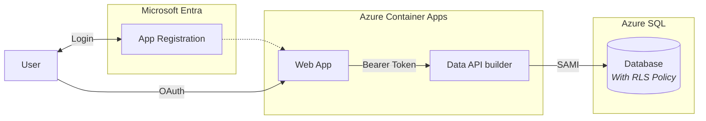
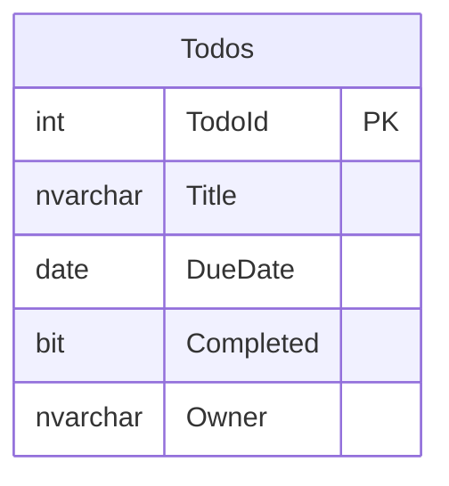

# Quickstart 5: Row-Level Security

Builds on [Quickstart 4](../quickstart4/) by moving enforcement into the **database** with SQL Row-Level Security. The authentication flow is identical to Quickstart 4. What changes is where authorization happens.

Instead of DAB enforcing user-based filtering, SQL enforces it directly using RLS policies tied to the authenticated context. Even if an API misconfigures filtering logic, the database enforces row-level restrictions. This is the most robust model because authorization is guaranteed at the data layer.

## What You'll Learn

- Create a SQL RLS filter predicate and security policy
- Push per-user access control into the database engine
- Remove DAB policies — the database enforces isolation directly

## Auth Matrix

| Hop | Local | Azure |
|-----|-------|-------|
| User → Web | Entra ID (auto-redirect) | Entra ID (auto-redirect) |
| Web → API | Bearer token | Bearer token |
| API → SQL | SQL Auth + **RLS** | SAMI + **RLS** |

## Architecture



> **Considerations on Row-Level Security**:
> RLS pushes access control into the database engine itself. Even if an API misconfigures filtering logic, the database enforces row-level restrictions. This is the most robust model because authorization is guaranteed at the data layer.

## Prerequisites

- [.NET 10+ SDK](https://dotnet.microsoft.com/download)
- [Aspire workload](https://learn.microsoft.com/dotnet/aspire/fundamentals/setup-tooling) — `dotnet workload install aspire`
- [Azure CLI](https://docs.microsoft.com/cli/azure/install-azure-cli) (for Entra ID setup)
- [Data API Builder CLI](https://learn.microsoft.com/azure/data-api-builder/) — `dotnet tool restore`
- [Docker Desktop](https://www.docker.com/products/docker-desktop/)
- [PowerShell](https://learn.microsoft.com/powershell/scripting/install/installing-powershell)

**Azure Permissions Required:** Create app registrations in Entra ID.

## Run Locally

```bash
dotnet tool restore
az login
aspire run
```

On first run, Aspire detects Entra ID isn't configured and walks you through setup. The script creates an app registration, updates `config.js` and `dab-config.json`, then starts normally.

## Deploy to Azure

```bash
azd auth login
azd up
```

The `preprovision` hook runs `entra-setup.ps1` automatically. After teardown, `azd down` runs `entra-teardown.ps1` to delete the app registration.

## The RLS Policy

SQL Server enforces row-level access using a filter predicate:

```sql
CREATE FUNCTION dbo.UserFilterPredicate(@OwnerId sysname)
RETURNS TABLE WITH SCHEMABINDING AS
RETURN SELECT 1 AS IsVisible WHERE @OwnerId = SUSER_SNAME();

CREATE SECURITY POLICY UserFilterPolicy
ADD FILTER PREDICATE dbo.UserFilterPredicate(Owner) ON dbo.Todos
WITH (STATE = ON);
```

Even if DAB returns all rows, SQL only delivers those where `Owner` matches the database user. Authorization is guaranteed at the data layer.

## What Changed from Quickstart 4

| File | Change |
|------|--------|
| `api/dab-config.json` | Removed `policy` from all actions — no DAB-level filtering |
| `database.sql` | Added `UserFilterPredicate` function and `UserFilterPolicy` security policy |

> The auth flow and web app are identical to Quickstart 4. Only the enforcement layer moved from DAB into SQL.

## Database Schema



> The `Owner` column stores the Entra ID UPN. The RLS policy filters rows automatically at the SQL layer.
