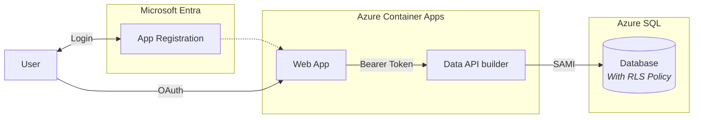
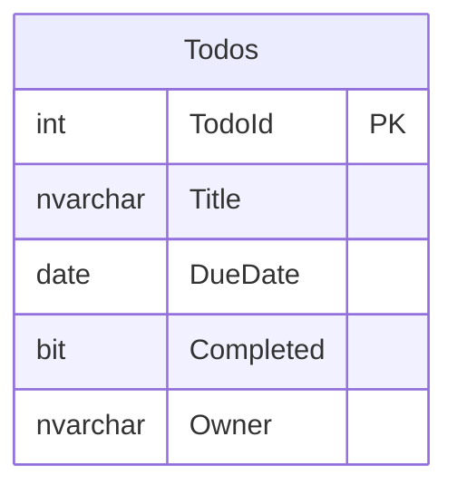

# Quickstart 5: Row-Level Security

Moves enforcement into the **database** with SQL Row-Level Security. The authentication flow uses Microsoft Entra ID, and authorization is enforced by SQL.

Instead of DAB enforcing user-based filtering, SQL enforces it directly using RLS policies tied to the authenticated context. Even if an API misconfigures filtering logic, the database enforces row-level restrictions. This is the most robust model because authorization is guaranteed at the data layer.

## What You'll Learn

- Create a SQL RLS filter predicate and security policy
- Push per-user access control into the database engine
- Remove DAB policies — the database enforces isolation directly

## Auth Matrix

| Hop | Local | Azure |
|-----|-------|-------|
| User → Web | Entra ID (auto-redirect) | Entra ID (auto-redirect) |
| Web → API | Bearer token | Bearer token |
| API → SQL | SQL Auth + **RLS** | SAMI + **RLS** |

## Architecture


```mermaid
flowchart LR
    U[User]

    subgraph Microsoft Entra
        E[App Registration]
    end

    subgraph Azure Container Apps
        W[Web App]
        A[Data API builder]
    end

    subgraph Azure SQL
        S[(Database<br/><i>With RLS Policy</i>)]
    end

    E -.-> W
    U <-->|Login| E
    U -->|OAuth| W -->|Bearer Token| A -->|SAMI| S
```

> **Considerations on Row-Level Security**:
> RLS pushes access control into the database engine itself. Even if an API misconfigures filtering logic, the database enforces row-level restrictions. This is the most robust model because authorization is guaranteed at the data layer.

## Prerequisites

- [.NET 8 or later](https://dotnet.microsoft.com/download)
- [Aspire workload](https://learn.microsoft.com/dotnet/aspire/fundamentals/setup-tooling) — `dotnet workload install aspire`
- [Azure CLI](https://docs.microsoft.com/cli/azure/install-azure-cli) (for Entra ID setup)
- [Data API Builder CLI](https://learn.microsoft.com/azure/data-api-builder/) — `dotnet tool restore`
- [Docker Desktop](https://www.docker.com/products/docker-desktop/)
- [PowerShell](https://learn.microsoft.com/powershell/scripting/install/installing-powershell)

**Azure Permissions Required:** Create app registrations in Entra ID.

## Run Locally

```bash
dotnet tool restore
az login
dotnet run --project aspire-apphost
```

On first run, Aspire detects Entra ID isn't configured and walks you through setup. The script creates an app registration, updates `config.js` and `dab-config.json`, then starts normally.

## Deploy to Azure

```bash
pwsh ./azure-infra/azure-up.ps1
```

The `preprovision` hook runs `entra-setup.ps1` automatically. During teardown via `azure-down.ps1`, the `postdown` hook runs `entra-teardown.ps1` to delete the app registration.

To tear down resources:

```bash
pwsh ./azure-infra/azure-down.ps1
```

## The RLS Policy

SQL Server enforces row-level access using a filter predicate:

```sql
CREATE FUNCTION dbo.UserFilterPredicate(@OwnerId sysname)
RETURNS TABLE WITH SCHEMABINDING AS
RETURN SELECT 1 AS IsVisible WHERE @OwnerId = CAST(SESSION_CONTEXT(N'preferred_username') AS sysname);

CREATE SECURITY POLICY UserFilterPolicy
ADD FILTER PREDICATE dbo.UserFilterPredicate(Owner) ON dbo.Todos
WITH (STATE = ON);
```

Data API builder sends authenticated JWT claims to SQL Server session context. Even if DAB requests all rows, SQL only delivers rows where `Owner` matches the signed-in user's `preferred_username` claim. Authorization is guaranteed at the data layer.

## Key Implementation Files

| File | Purpose |
|------|---------|
| `data-api/dab-config.json` | Removes DAB-level `policy` filtering and enables SQL session context for authenticated claims |
| `database/Functions/UserFilterPredicate.sql` | Adds the RLS predicate function |
| `database/Security/UserFilterPolicy.sql` | Adds the `UserFilterPolicy` security policy |

> The key behavior in this quickstart is that authorization is enforced in SQL with RLS rather than in DAB policy expressions.

## Database Schema


```mermaid
erDiagram
    Todos {
        int TodoId PK
        nvarchar Title
        date DueDate
        bit Completed
        nvarchar Owner
    }
```

> The `Owner` column stores the Entra ID UPN. The RLS policy filters rows automatically at the SQL layer.

## Recreate this quickstart with GitHub Copilot

Want to rebuild this quickstart from scratch with GitHub Copilot? Open a new empty folder in VS Code, switch GitHub Copilot to **agent mode**, and paste the prompt below. Copilot will collaborate with you to recreate the project end-to-end.

````
You are a senior developer pair-programming with me to recreate the **Quickstart 5: SQL Row-Level Security (RLS) with MSAL + DAB** sample from the dab-quickstarts repo. Goal: require MSAL sign-in and bearer tokens at DAB, then enforce row filtering **inside SQL** using a `SECURITY POLICY` and predicate function. Do not use DAB database policies in this quickstart.

## Repo conventions you must follow

- `azure-infra/` — Bicep + PowerShell deploy scripts (`azure-up.ps1`, `azure-down.ps1`, `post-provision.ps1`, plus Entra app lifecycle scripts).
- `data-api/` — `dab-config.json` and `Dockerfile`
- `database/` — SQL Database Project including a `Security/` folder for RLS objects
- `web-app/` — static HTML/JS + MSAL.js
- `aspire-apphost/` — .NET Aspire AppHost project
- `mcp-inspector/` — MCP Inspector container
- DAB is the only API/MCP layer for SQL — do not introduce a custom backend.

## Prerequisites — check silently first

- `dotnet --version` (.NET 8+)
- `docker --version` (Docker Desktop running)
- `az --version` (Azure CLI, logged in)
- `sqlpackage /version`
- `pwsh -v`
- Permission to create Entra app registrations via `az ad`.
Install missing dotnet tools via `dotnet tool install -g`. For Docker, point me to https://www.docker.com/products/docker-desktop/ and stop until I confirm.

## Collaborate with me before coding

Ask brief clarifying questions one at a time:
1. Azure subscription, region, and resource group name.
2. Sample schema (default: a per-user entity with an `Owner nvarchar(256) NOT NULL` column).
3. The RLS predicate shape — default to DAB-populated SQL `SESSION_CONTEXT(N'preferred_username')` so SQL filters by the signed-in user's claim.
4. Entra tenant ID, SPA + API app registrations (create new or reuse), and the API scope.
5. Confirm I understand this will create **real, billable Azure resources** plus Entra app registrations. Wait for an explicit "yes" before any create command.

## Show a visible todo list and keep it updated

```
- [ ] Prereqs verified
- [ ] Schema approved (includes Owner column)
- [ ] Database project created and built
- [ ] RLS predicate function + SECURITY POLICY created and verified ON
- [ ] Entra apps created (SPA + API) with admin consent
- [ ] DAB config created with EntraId provider, authenticated role, SQL session context enabled, and no DAB database policy
- [ ] Web app wired with MSAL.js and bearer header
- [ ] Aspire AppHost wired up
- [ ] Local run validated end-to-end (bearer auth works and SQL RLS filters by preferred_username claim)
- [ ] Azure infra deployed
- [ ] DAB image built and pushed to ACR
- [ ] Container Apps live
- [ ] Validation: RLS confirmed via sys.security_policies and claim-based SQL filtering
- [ ] report.md written
```

## Build steps

1. **Database** —
   - `database/database.sqlproj` (SDK `Microsoft.Build.Sql/2.0.0`).
   - `database/Tables/*.sql` including the entity with `Owner nvarchar(256) NOT NULL`.
    - `database/Functions/UserFilterPredicate.sql` — inline TVF matching the repo pattern: `RETURN SELECT 1 AS IsVisible WHERE @OwnerId = CAST(SESSION_CONTEXT(N'preferred_username') AS sysname);`.
    - `database/Security/UserFilterPolicy.sql` — `CREATE SECURITY POLICY UserFilterPolicy ADD FILTER PREDICATE dbo.UserFilterPredicate(Owner) ON dbo.Todos WITH (STATE = ON);`.
   - `database/Scripts/PostDeployment.sql` — idempotent seed data assigned to at least two different UPNs.
2. **DAB** — `data-api/dab-config.json` uses the GA DAB image `mcr.microsoft.com/azure-databases/data-api-builder:latest`. Configure EntraId provider as in Quickstart 4 and explicitly set `data-source.options.set-session-context` to `true`. Entities are exposed under the `authenticated` role and must not include per-entity database policies — SQL RLS does the filtering from session context.
3. **DAB Dockerfile** — `data-api/Dockerfile` copies `dab-config.json` into the image.
4. **Entra apps** — same SPA + API pattern as Quickstart 4 (`api://<api-appId>/access`). Write Entra env vars to `.env`.
5. **Aspire** — `aspire-apphost/Aspire.AppHost.csproj` and `Program.cs` orchestrate SQL Server, deploy the dacpac (including Security objects), and run DAB, the web app, SQL Commander, and MCP Inspector.
6. **Web app** — MSAL.js sign-in + bearer header on every DAB call (`config.js`, `app.js`, `dab.js`, `index.html`), same shape as Quickstart 4.
7. **DB auth from DAB** — passwordless SAMI for Azure. SQL Auth is acceptable locally.
8. **Permissions** — ensure the DAB SQL user can read the secured tables (`db_datareader`/`db_datawriter`) and that the RLS predicate/security policy are included in the dacpac.

## Local validation

- Aspire dashboard at `http://localhost:15888` — every resource green.
- DAB health: `curl http://localhost:5000/health` returns healthy.
- After sign-in, REST/GraphQL requests require a bearer token and reach DAB under the `authenticated` role.
- DAB-backed data check: verify DAB sends `preferred_username` into SQL `SESSION_CONTEXT` and SQL filters rows at the database layer.
- `SELECT name, is_enabled FROM sys.security_policies` shows the policy as `is_enabled = 1`.
- MCP: open MCP Inspector and invoke a DAB MCP tool with a token.
- SQL Commander loads (seed data spans multiple UPNs).

## Azure deployment

Generate `azure-infra/main.bicep`, `resources.bicep`, `main.parameters.json`, and `azure-infra/azure-up.ps1` that:
- Run the Entra script first.
- Create RG, Log Analytics, Container Apps Environment, ACR, Azure SQL server + database.
- DAB Container App with **System-Assigned Managed Identity**.
- Build and push the DAB image via `az acr build`.
- Deploy Container Apps for `web-app`, `data-api`, `mcp-inspector`, `sql-commander`, propagating Entra env vars and passwordless connection string.
- Run `post-provision.ps1` to set Entra admin, create the SAMI user, grant required roles, and verify the RLS policy is enabled.

Print progress like `[1/11] Creating Entra apps...` after each step. On any failure, diagnose with `az` queries and retry.

## Cloud validation

- DAB `/health` on the public FQDN returns healthy.
- Sign-in flow works; authenticated requests reach DAB, and DAB-backed data checks prove the database policy filters rows according to `SESSION_CONTEXT(N'preferred_username')`.
- `sys.security_policies` enabled.
- Querying through DAB as two different signed-in users returns different row sets when `Owner` values differ.
- All Container Apps `Running` and `Healthy`.

## Troubleshooting playbook

- All users see 0 rows → `Owner` values do not match the `preferred_username` claim, or DAB is not sending claims into SQL session context.
- All users see all rows → policy not enabled. `ALTER SECURITY POLICY ... WITH (STATE = ON);`.
- DAB returns rows but SQL direct tests do not → remember session context is populated by DAB per request; test through DAB or manually set `SESSION_CONTEXT` in a SQL test session.
- `Login failed` → SAMI user missing in Azure SQL; re-run `post-provision.ps1`.
- Container Apps logs: `az containerapp logs show -n <app> -g <rg> --tail 200`.
Iterate until validation passes.

## Secrets and safety

- `.env` holds Entra IDs and (locally) any SQL password (no `$`). Ensure `.gitignore` includes `.env`, `**/bin`, `**/obj` **before** writing any secret.
- No client secret is required for this quickstart.
- Redact tokens and any secret in output as `***redacted***`.

## Cleanup

Run `pwsh ./azure-infra/azure-down.ps1` to delete the resource group, then the Entra teardown script to delete both app registrations. Confirm with `az group exists` and `az ad app list`.

## Final deliverable: `report.md`

- **Summary** — what was built and the auth model (MSAL + bearer to DAB; **RLS at the SQL layer** filters rows; no DAB database policy).
- **Azure resources** — RG, SQL server + DB, ACR, Container Apps Environment, each Container App, Log Analytics, plus the two Entra app registrations.
- **URLs** — web app FQDN, DAB `/health`, REST/GraphQL/MCP endpoints, SQL Commander, MCP Inspector, Azure portal deep link, Entra portal links.
- **Auth mode** — MSAL + bearer + DAB SAMI to Azure SQL with Row-Level Security enforced by `SECURITY POLICY` driven by DAB-populated SQL session context (`preferred_username`).
- **Secrets handling** — list `.env` keys and Container App env vars / secrets. Values as `***redacted***`. Confirm no client secrets created.
- **Validation evidence** —
  - `sys.security_policies` row showing `is_enabled = 1`.
    - An authenticated DAB request with bearer token.
    - A SQL query or DAB request proving rows are filtered by `SESSION_CONTEXT(N'preferred_username')` at the database layer.
  - REST/GraphQL/MCP samples.
- **Failures and manual steps** — anything that did not auto-succeed and how it was fixed (RLS policy state, contained users, or `Owner` value alignment).
- **Cleanup commands** — exact commands including Entra teardown.
- **Next steps** — combine RLS with OBO so SQL audit logs show the **end-user** identity (Quickstart 6).

Begin by greeting me and asking the first clarifying question.
````
