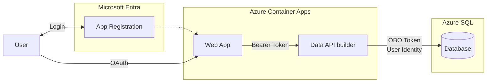

# Quickstart 6: On-Behalf-Of (OBO) Flow

Builds on [Quickstart 4](../quickstart4/) by demonstrating **On-Behalf-Of (OBO) authentication** in Data API Builder. Users authenticate with Microsoft Entra ID, and DAB exchanges the user's token to connect to SQL Server as that user's identity — not as a service account.

## What You'll Learn

- Configure DAB to use On-Behalf-Of authentication to SQL
- Flow the user's identity from browser → API → database
- Let SQL see the actual user principal (not a service identity)

## Architecture



> **Why OBO?** Unlike Managed Identity (where SQL sees the app's identity), OBO passes the actual user identity to the database. SQL Server sees `user@contoso.com` — powerful for auditing and native SQL permissions.

## Prerequisites

- [.NET 8 or later](https://dotnet.microsoft.com/download)
- [Aspire workload](https://learn.microsoft.com/dotnet/aspire/fundamentals/setup-tooling) — `dotnet workload install aspire`
- [Azure CLI](https://docs.microsoft.com/cli/azure/install-azure-cli) (for Entra ID setup)
- [Data API Builder CLI](https://learn.microsoft.com/azure/data-api-builder/) — `dotnet tool restore`
- [Docker Desktop](https://www.docker.com/products/docker-desktop/)
- [PowerShell](https://learn.microsoft.com/powershell/scripting/install/installing-powershell)

**Azure Permissions Required:** Create app registrations in Entra ID with OBO configuration.

## Run Locally

```bash
dotnet tool restore
az login
dotnet run --project aspire-apphost
```

On first run, the script detects Entra ID isn't configured and walks you through setup.

## Deploy to Azure

```bash
pwsh ./azure-infra/azure-up.ps1
```

To tear down resources:

```bash
pwsh ./azure-infra/azure-down.ps1
```

## What Changed from Quickstart 4

| File | Change |
|------|--------|
| `api/dab-config.json` | Added OBO configuration in data-source options |
| `azure-infra/entra-setup.ps1` | Creates app registration with client secret and SQL delegation |

## Related Quickstarts

| Quickstart | Inbound | Outbound | Security |
|------------|---------|----------|----------|
| [Quickstart 1](../quickstart1/) | Anonymous | SQL Auth | — |
| [Quickstart 2](../quickstart2/) | Anonymous | Managed Identity | — |
| [Quickstart 3](../quickstart3/) | Entra ID | Managed Identity | — |
| [Quickstart 4](../quickstart4/) | Entra ID | Managed Identity | API RLS |
| [Quickstart 5](../quickstart5/) | Entra ID | Managed Identity | DB RLS |
| **This repo** | Entra ID | **OBO** | — |
