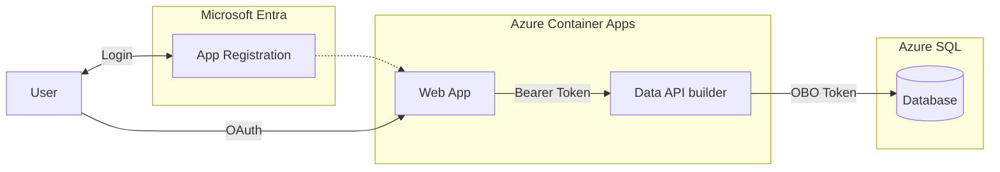

# Quickstart 6: On-Behalf-Of (OBO) Flow

Builds on [Quickstart 4](../quickstart4/) by demonstrating **On-Behalf-Of (OBO) authentication** in Data API Builder 2.0. Users authenticate with Microsoft Entra ID, and DAB exchanges the user's token to connect to Azure SQL as that user's identity — not as a service account.

A `WhoAmI` view (`SELECT SUSER_NAME()`) proves that SQL Server sees the real user — not the managed identity.

## What You'll Learn

- Configure DAB `user-delegated-auth` for OBO token exchange
- Create an Entra app registration with a client secret and `Azure SQL Database` delegated permission
- Flow the user's identity from browser → API → database
- Validate with `SUSER_NAME()` that SQL sees the actual caller

## Auth Matrix

| Hop | Local (Aspire) | Azure |
|-----|----------------|-------|
| User → Web | MSAL login | MSAL login |
| Web → API | Bearer token | Bearer token |
| API → SQL | SQL Auth (OBO not supported on Docker SQL) | **OBO — user identity** |

> **Important:** OBO requires Azure SQL with Entra ID authentication. Docker SQL Server does not support Entra tokens, so OBO is an **Azure-only** feature. Locally, Aspire runs DAB with SQL Auth — the app works, but `WhoAmI` returns the SQL admin, not the user.

## Architecture



> **Why OBO?** Unlike Managed Identity (where SQL sees the app's identity), OBO passes the actual user identity to the database. SQL Server sees `jerry@nixoncorp.com` — powerful for auditing and native SQL permissions.

## Prerequisites

- [.NET 8 or later](https://dotnet.microsoft.com/download)
- [Aspire workload](https://learn.microsoft.com/dotnet/aspire/fundamentals/setup-tooling) — `dotnet workload install aspire`
- [Azure CLI](https://docs.microsoft.com/cli/azure/install-azure-cli) (for Entra ID setup)
- [Data API Builder CLI](https://learn.microsoft.com/azure/data-api-builder/) — `dotnet tool restore`
- [Docker Desktop](https://www.docker.com/products/docker-desktop/)
- [PowerShell](https://learn.microsoft.com/powershell/scripting/install/installing-powershell)

**Azure Permissions Required:** Create app registrations in Entra ID, grant admin consent for Azure SQL Database delegation, and create client secrets.

## Run Locally

```bash
dotnet tool restore
az login
dotnet run --project aspire-apphost
```

On first run, Aspire detects that Entra ID isn't configured and offers to run `azure-infra/entra-setup.ps1` interactively. This creates the app registration with a client secret, grants the `Azure SQL Database` `user_impersonation` permission, and updates `dab-config.json` and `config.js`.

> **Note:** Locally, OBO is inactive because Docker SQL Server doesn't accept Entra tokens. The Todo app works with SQL Auth, and `WhoAmI` returns the SQL admin user. Deploy to Azure to see the full OBO flow.

## Deploy to Azure

```bash
pwsh ./azure-infra/azure-up.ps1
```

The `preprovision` hook runs `entra-setup.ps1` automatically. The `postprovision` hook deploys the schema, grants the signed-in user database access, enables OBO in DAB config, builds container images, and configures the container apps with OBO environment variables.

To tear down resources:

```bash
pwsh ./azure-infra/azure-down.ps1
```

## Validating OBO

Once deployed to Azure, open the web app. The **"SQL Server sees you as:"** badge at the top shows the result of `SELECT SUSER_NAME()`. If OBO is working, it displays your email (e.g., `jerry@nixoncorp.com`) instead of the managed identity name.

You can also call the API directly:

```bash
curl -H "Authorization: Bearer <your-token>" https://<dab-fqdn>/api/WhoAmI
```

## What Changed from Quickstart 4

| File | Change |
|------|--------|
| `data-api/dab-config.json` | Added `user-delegated-auth` (OBO) under `data-source`; disabled cache; added `WhoAmI` view entity |
| `database/Views/WhoAmI.sql` | New view: `SELECT SUSER_NAME() AS UserName` |
| `web-app/index.html` | Added identity badge showing SQL identity |
| `web-app/dab.js` | Added `fetchWhoAmI()` function |
| `web-app/app.js` | Calls `updateIdentity()` on load and refresh |
| `azure-infra/entra-setup.ps1` | Creates client secret; adds Azure SQL Database `user_impersonation` permission |
| `azure-infra/resources.bicep` | DAB container app receives `oboClientSecret` as a secret; `DAB_OBO_CLIENT_SECRET` env var |
| `azure-infra/main.bicep` | New `oboClientSecret` parameter piped through to resources |
| `azure-infra/post-provision.ps1` | Grants signed-in user DB access; enables OBO in DAB config; sets `DAB_OBO_CLIENT_ID` and `DAB_OBO_TENANT_ID` env vars |

## Related Quickstarts

| Quickstart | Inbound | Outbound | Security |
|------------|---------|----------|----------|
| [Quickstart 1](https://github.com/Azure-Samples/dab-2.0-quickstart-web_anon-api_anon-db_sql_auth) | Anonymous | SQL Auth | — |
| [Quickstart 2](https://github.com/Azure-Samples/dab-2.0-quickstart-web_anon-api_anon-db_entra) | Anonymous | Managed Identity | — |
| [Quickstart 3](https://github.com/Azure-Samples/dab-2.0-quickstart-web_anon-api_entra-db_entra) | Entra ID | Managed Identity | — |
| [Quickstart 4](https://github.com/Azure-Samples/dab-2.0-quickstart-web_entra-api_entra-db_entra-api_rls) | Entra ID | Managed Identity | API RLS |
| [Quickstart 5](https://github.com/Azure-Samples/dab-2.0-quickstart-web_entra-api_entra-db_entra-db_rls) | Entra ID | Managed Identity | DB RLS |
| **This repo** | Entra ID | **OBO** | — |

## Next Steps

- Read the [OBO documentation](https://learn.microsoft.com/azure/data-api-builder/concept/security/authenticate-on-behalf-of) for configuration details
- Combine OBO with Row-Level Security for user-aware SQL policies
