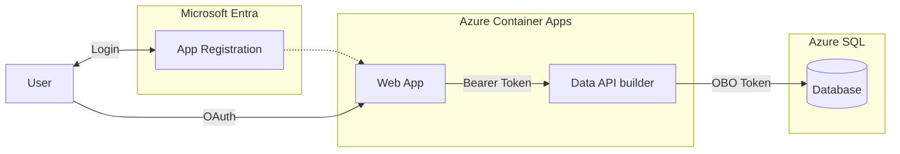

# Quickstart 6: On-Behalf-Of (OBO) Flow

Demonstrates **On-Behalf-Of (OBO) / user-delegated authentication** in Data API Builder 2.0. Users sign in with Microsoft Entra ID, and DAB exchanges the user's token to connect to Azure SQL **as that user's identity** — not as a service account.

A `WhoAmI` view (`SELECT SUSER_NAME()`) proves that SQL Server sees the real user. The web app shows this identity in a prominent badge: **"SQL Server sees you as: jerry@nixoncorp.com"**.

## What You'll Learn

- Configure DAB `user-delegated-auth` for OBO token exchange
- Create an Entra app registration with a client secret and `Azure SQL Database` delegated permission
- Flow the user's identity from browser → API → database
- Validate with `SUSER_NAME()` that SQL sees the actual caller
- Use a **bare connection string** (no `Authentication=` keyword) so DAB can inject the OBO token per-request

## Azure-Only

> **Important:** OBO requires Azure SQL with Entra ID authentication configured. A local Docker SQL Server container cannot accept Entra tokens — the OBO token exchange calls `login.microsoftonline.com` and requires Azure SQL's external provider support. **This quickstart is Azure-only by design.** There is no local Aspire option for the full OBO flow.

## Auth Matrix

| Hop | Who |
|-----|-----|
| User → Web App | MSAL browser login (Entra ID) |
| Web App → DAB API | Bearer token (JWT) |
| DAB API → Azure SQL | **OBO token — the actual user's identity** |

## Architecture



> **Why OBO?** Unlike Managed Identity (where SQL sees the app's identity), OBO passes the actual user's identity to the database. SQL Server sees `jerry@nixoncorp.com` — powerful for auditing, row-level security, and SUSER_NAME()-based policies.

## Prerequisites

- [Azure CLI](https://docs.microsoft.com/cli/azure/install-azure-cli)
- [Azure Developer CLI (azd)](https://learn.microsoft.com/azure/developer/azure-developer-cli/install-azd)
- [Data API Builder CLI](https://learn.microsoft.com/azure/data-api-builder/) — `dotnet tool restore`
- [PowerShell](https://learn.microsoft.com/powershell/scripting/install/installing-powershell)
- **Entra ID permissions:** ability to create app registrations, grant admin consent, and create client secrets in your tenant

## Deploy to Azure

```powershell
pwsh ./azure-infra/azure-up.ps1
```

This runs `azd up` which automatically:

1. **Pre-provision** (`entra-setup.ps1`) — creates the Entra app registration, exposes `access_as_user` scope, adds `Azure SQL Database` `user_impersonation` delegated permission, creates client secret, updates `dab-config.json` and `config.js`
2. **Bicep provision** — creates SQL Server + Database, Container Apps Environment, ACR, and Container Apps for DAB, web app, SQL Commander, and MCP Inspector
3. **Post-provision** (`post-provision.ps1`) — deploys schema via SqlPackage, sets Entra admin on SQL Server, creates database users for the DAB managed identity and the signed-in user, builds and pushes custom container images, configures OBO environment variables

Deployment takes approximately **15–20 minutes**.

## Tear Down

```powershell
pwsh ./azure-infra/azure-down.ps1
```

Deletes all Azure resources, removes the Entra app registration, and resets local config files to placeholder state.

## Validating OBO

Once deployed, open the web app URL (printed at end of `azure-up.ps1`). The **"SQL Server sees you as:"** badge shows `SELECT SUSER_NAME()`. If OBO is working, it shows your Entra email, not the managed identity name.

You can also call the API directly:

```bash
curl -H "Authorization: Bearer <your-token>" https://<dab-fqdn>/api/WhoAmI
```

## Key Implementation Detail — Bare Connection String

When OBO is enabled, the connection string **must not** include an `Authentication=` keyword. `Microsoft.Data.SqlClient` throws if `AccessToken` is set and `Authentication=` is already present.

✅ Correct:
```
Server=tcp:<server>.database.windows.net,1433;Database=<db>;Encrypt=true;TrustServerCertificate=true
```

❌ Broken (causes HTTP 500 on every authenticated request):
```
Server=tcp:<server>.database.windows.net,1433;Database=<db>;Authentication=Active Directory Managed Identity;...
```

DAB 2.0 with OBO uses Azure.Identity (MSI) automatically for health checks and acquires the per-user OBO token for each authenticated request.

## What Changed from Quickstart 4

| File | Change |
|------|--------|
| `data-api/dab-config.json` | Added `user-delegated-auth` (OBO) under `data-source`; disabled cache; added `WhoAmI` view entity |
| `database/Views/WhoAmI.sql` | New view: `SELECT SUSER_NAME() AS UserName` |
| `web-app/index.html` | Added identity badge showing SQL identity; debug log pinned to viewport bottom |
| `web-app/dab.js` | Added `fetchWhoAmI()` function |
| `web-app/app.js` | Calls `updateIdentity()` on load and refresh |
| `azure-infra/entra-setup.ps1` | Creates client secret; adds Azure SQL Database `user_impersonation` permission |
| `azure-infra/resources.bicep` | DAB uses bare connection string (no `Authentication=`); OBO secrets wired in |
| `azure-infra/post-provision.ps1` | Grants signed-in user DB access; enables OBO in DAB config; sets OBO env vars; forces revision suffix on image updates |

## Related Quickstarts

| Quickstart | Inbound | Outbound | Security |
|------------|---------|----------|----------|
| [Quickstart 1](https://github.com/Azure-Samples/dab-2.0-quickstart-web_anon-api_anon-db_sql_auth) | Anonymous | SQL Auth | — |
| [Quickstart 2](https://github.com/Azure-Samples/dab-2.0-quickstart-web_anon-api_anon-db_entra) | Anonymous | Managed Identity | — |
| [Quickstart 3](https://github.com/Azure-Samples/dab-2.0-quickstart-web_anon-api_entra-db_entra) | Entra ID | Managed Identity | — |
| [Quickstart 4](https://github.com/Azure-Samples/dab-2.0-quickstart-web_entra-api_entra-db_entra-api_rls) | Entra ID | Managed Identity | API RLS |
| [Quickstart 5](https://github.com/Azure-Samples/dab-2.0-quickstart-web_entra-api_entra-db_entra-db_rls) | Entra ID | Managed Identity | DB RLS |
| **This repo** | Entra ID | **OBO** | — |

## Next Steps

- Read the [OBO documentation](https://learn.microsoft.com/azure/data-api-builder/concept/security/authenticate-on-behalf-of) for configuration details
- Combine OBO with Row-Level Security for user-aware SQL policies

