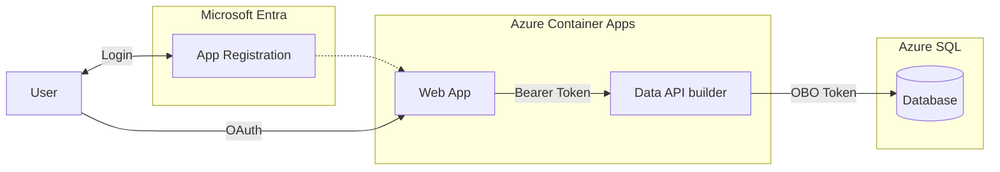

# Quickstart 6: On-Behalf-Of (OBO) Flow

Demonstrates **On-Behalf-Of (OBO) / user-delegated authentication** in Data API Builder 2.0. Users sign in with Microsoft Entra ID, and DAB exchanges the user's token to connect to Azure SQL **as that user's identity** — not as a service account.

A `WhoAmI` view (`SELECT SUSER_NAME()`) proves that SQL Server sees the real user. The web app shows this identity in a prominent badge: **"SQL Server sees you as: jerry@nixoncorp.com"**.

## What You'll Learn

- Configure DAB `user-delegated-auth` for OBO token exchange
- Create an Entra app registration with a client secret and `Azure SQL Database` delegated permission
- Flow the user's identity from browser → API → database
- Validate with `SUSER_NAME()` that SQL sees the actual caller
- Use a **bare connection string** (no `Authentication=` keyword) so DAB can inject the OBO token per-request

## Azure-Only

> **Important:** OBO requires Azure SQL with Entra ID authentication configured. A local Docker SQL Server container cannot accept Entra tokens — the OBO token exchange calls `login.microsoftonline.com` and requires Azure SQL's external provider support. **This quickstart is Azure-only by design.** There is no local Aspire option for the full OBO flow.

## Auth Matrix

| Hop | Who |
|-----|-----|
| User → Web App | MSAL browser login (Entra ID) |
| Web App → DAB API | Bearer token (JWT) |
| DAB API → Azure SQL | **OBO token — the actual user's identity** |

## Architecture


```mermaid
flowchart LR
    U[User]

    subgraph Microsoft Entra
        E[App Registration]
    end

    subgraph Azure Container Apps
        W[Web App]
        A[Data API builder]
    end

    subgraph Azure SQL
        S[(Database)]
    end

    U <-->|Login| E
    E -.-> W
    U -->|OAuth| W -->|Bearer Token| A -->|OBO Token| S
```

> **Why OBO?** Unlike Managed Identity (where SQL sees the app's identity), OBO passes the actual user's identity to the database. SQL Server sees `jerry@nixoncorp.com` — powerful for auditing, row-level security, and SUSER_NAME()-based policies.

## Prerequisites

- [Azure CLI](https://docs.microsoft.com/cli/azure/install-azure-cli)
- [Azure Developer CLI (azd)](https://learn.microsoft.com/azure/developer/azure-developer-cli/install-azd)
- [Data API Builder CLI](https://learn.microsoft.com/azure/data-api-builder/) — `dotnet tool restore`
- [PowerShell](https://learn.microsoft.com/powershell/scripting/install/installing-powershell)
- **Entra ID permissions:** ability to create app registrations, grant admin consent, and create client secrets in your tenant

## Deploy to Azure

```powershell
pwsh ./azure-infra/azure-up.ps1
```

This runs `azd up` which automatically:

1. **Pre-provision** (`entra-setup.ps1`) — creates the Entra app registration, exposes `access_as_user` scope, adds `Azure SQL Database` `user_impersonation` delegated permission, creates client secret, updates `dab-config.json` and `config.js`
2. **Bicep provision** — creates SQL Server + Database, Container Apps Environment, ACR, and Container Apps for DAB, web app, SQL Commander, and MCP Inspector
3. **Post-provision** (`post-provision.ps1`) — deploys schema via SqlPackage, sets Entra admin on SQL Server, creates database users for the DAB managed identity and the signed-in user, builds and pushes custom container images, configures OBO environment variables

Deployment takes approximately **15–20 minutes**.

## Tear Down

```powershell
pwsh ./azure-infra/azure-down.ps1
```

Deletes all Azure resources, removes the Entra app registration, and resets local config files to placeholder state.

## Validating OBO

Once deployed, open the web app URL (printed at end of `azure-up.ps1`). The **"SQL Server sees you as:"** badge shows `SELECT SUSER_NAME()`. If OBO is working, it shows your Entra email, not the managed identity name.

You can also call the API directly:

```bash
curl -H "Authorization: Bearer <your-token>" https://<dab-fqdn>/api/WhoAmI
```

## Key Implementation Detail — Bare Connection String

When OBO is enabled, the connection string **must not** include an `Authentication=` keyword. `Microsoft.Data.SqlClient` throws if `AccessToken` is set and `Authentication=` is already present.

✅ Correct:
```
Server=tcp:<server>.database.windows.net,1433;Database=<db>;Encrypt=true;TrustServerCertificate=true
```

❌ Broken (causes HTTP 500 on every authenticated request):
```
Server=tcp:<server>.database.windows.net,1433;Database=<db>;Authentication=Active Directory Managed Identity;...
```

DAB 2.0 with OBO uses Azure.Identity (MSI) automatically for health checks and acquires the per-user OBO token for each authenticated request.

## Key Implementation Files

| File | Purpose |
|------|---------|
| `data-api/dab-config.json` | Enables `user-delegated-auth` (OBO) under `data-source`, disables cache, and adds `WhoAmI` view entity |
| `database/Views/WhoAmI.sql` | Defines `SELECT SUSER_NAME() AS UserName` for identity verification |
| `web-app/index.html` | Shows identity badge for SQL identity and includes debug log area |
| `web-app/dab.js` | Implements `fetchWhoAmI()` |
| `web-app/app.js` | Calls `updateIdentity()` on load and refresh |
| `azure-infra/entra-setup.ps1` | Creates client secret and adds Azure SQL Database `user_impersonation` permission |
| `azure-infra/resources.bicep` | Uses bare SQL connection string (no `Authentication=`) and wires OBO secrets |
| `azure-infra/post-provision.ps1` | Grants signed-in user DB access, enables OBO in DAB config, sets OBO env vars, and forces revision suffix on image updates |


## Next Steps

- Read the [OBO documentation](https://learn.microsoft.com/azure/data-api-builder/concept/security/authenticate-on-behalf-of) for configuration details
- Combine OBO with Row-Level Security for user-aware SQL policies


## Recreate this quickstart with GitHub Copilot

Want to rebuild this quickstart from scratch with GitHub Copilot? Open a new empty folder in VS Code, switch GitHub Copilot to **agent mode**, and paste the prompt below. Copilot will collaborate with you to recreate the project end-to-end.

````
You are a senior developer pair-programming with me to recreate the **Quickstart 6: User-delegated auth (OBO) to Azure SQL via DAB** sample from the dab-quickstarts repo. Goal: an **Azure-only** end-to-end demo where MSAL signs the user in, sends a bearer token to DAB, and DAB performs **On-Behalf-Of (OBO)** to acquire an **Azure SQL token for the signed-in user** and connects to Azure SQL **as that user** — not as a service principal. SQL audit logs show the end-user.

> **Azure-only**: the OBO flow requires Azure SQL and a real Entra tenant. There is no meaningful local SQL Server path for the OBO trust chain. Do not invest in a local-only run beyond what Aspire gives you for the web app and dacpac build.

## Repo conventions you must follow

- `azure-infra/` — Bicep + PowerShell deploy scripts (`azure-up.ps1`, `azure-down.ps1`, `post-provision.ps1`, plus Entra app lifecycle scripts).
- `data-api/` — `dab-config.json` and `Dockerfile`
- `database/` — SQL Database Project, including a `WhoAmI` view or stored procedure
- `web-app/` — static HTML/JS + MSAL.js
- `aspire-apphost/` — .NET Aspire AppHost project (used for build/orchestration; not the production runtime)
- `mcp-inspector/` — MCP Inspector container
- DAB is the only API/MCP layer for SQL — do not introduce a custom backend.

## Prerequisites — check silently first

- `dotnet --version` (.NET 8+)
- `docker --version` (Docker Desktop running)
- `az --version` (Azure CLI, logged in)
- `sqlpackage /version`
- `pwsh -v`
- Permission to create Entra app registrations and grant **delegated permissions** (admin consent) on Azure SQL.
Install missing dotnet tools via `dotnet tool install -g`. For Docker, point me to https://www.docker.com/products/docker-desktop/ and stop until I confirm.

## Collaborate with me before coding

Ask brief clarifying questions one at a time:
1. Azure subscription, region, and resource group name.
2. Sample schema (default: a small per-user table plus a `WhoAmI` view that returns `SUSER_NAME() AS UserName`).
3. Entra tenant ID; SPA + API app registrations (create new or reuse). Confirm I want a **client secret** on the API app (required for OBO).
4. The **Azure SQL delegated permission** (`https://database.windows.net/user_impersonation`) — confirm we will add it to the API app and grant admin consent.
5. Azure SQL Entra admin (user or group). End-users must exist as **contained Entra users** in the database; confirm whether to add a group or individual users.
6. Confirm I understand this will create **real, billable Azure resources** plus Entra app registrations and a client secret. Wait for an explicit "yes" before any create command.

## Show a visible todo list and keep it updated

```
- [ ] Prereqs verified
- [ ] Schema approved (includes WhoAmI view/proc)
- [ ] Database project created and built
- [ ] Entra apps created: SPA + API, API has client secret and Azure SQL user_impersonation delegated permission with admin consent
- [ ] DAB config created with EntraId provider, OBO settings, and BARE SQL connection string (no creds)
- [ ] Web app wired with MSAL.js and bearer header
- [ ] Aspire AppHost wired up (build + dacpac path)
- [ ] Azure infra deployed
- [ ] DAB image built and pushed to ACR
- [ ] Container Apps live
- [ ] Azure SQL Entra admin set; end-user(s) added as contained users
- [ ] Validation: WhoAmI returns the SIGNED-IN USER, not the DAB SP
- [ ] report.md written
```

## Build steps

1. **Database** —
   - `database/database.sqlproj` (SDK `Microsoft.Build.Sql/2.0.0`).
   - `database/Tables/*.sql` for the demo entity.
    - `database/Views/WhoAmI.sql` returning `SUSER_NAME() AS UserName`.
   - `database/Scripts/PostDeployment.sql` with idempotent seed data.
2. **Entra apps** —
   - **API app**: expose scope `api://<api-appId>/access`; add **delegated permission** `https://database.windows.net/user_impersonation`; grant admin consent; create a **client secret** (capture as `ENTRA_API_CLIENT_SECRET`).
   - **SPA app**: redirect URI for web FQDN; delegated permission on the API scope; admin consent.
   Write `ENTRA_TENANT_ID`, `ENTRA_AUDIENCE`, `ENTRA_ISSUER`, `ENTRA_API_CLIENT_ID`, `SPA_CLIENT_ID`, `API_SCOPE` to `.env`; write `ENTRA_API_CLIENT_SECRET` to `.env` **only**, and never to source.
3. **DAB** — `data-api/dab-config.json` and `data-api/Dockerfile` use the GA DAB image `mcr.microsoft.com/azure-databases/data-api-builder:latest` because OBO requires DAB 2.0+. Configure:
   - `authentication.provider: EntraId` with the audience/issuer.
   - **OBO** settings using the API app's client ID + tenant + client secret (per current DAB OBO docs).
   - `data-source` connection string is **bare**: `Server=tcp:<sqlserver>.database.windows.net,1433;Database=<db>;Encrypt=True;TrustServerCertificate=False;` — **no `User ID`, no `Password`, no `Authentication=...`**. DAB will acquire a user-delegated Azure SQL token via OBO and use it on the connection.
   - Entities exposed under `authenticated` role; remove `anonymous`.
4. **DAB Dockerfile** — `data-api/Dockerfile` copies `dab-config.json` into the image.
5. **Aspire** — used to build the dacpac and orchestrate web app + DAB locally for development of UI/config; the OBO trust chain only works against Azure SQL.
6. **Web app** — MSAL.js sign-in + bearer header on every DAB call (`config.js`, `app.js`, `dab.js`, `index.html`). Add a "WhoAmI" button that calls the DAB endpoint and renders the result.
7. **post-provision.ps1** —
   - Set Azure SQL Entra admin.
   - For each test user (or group): `CREATE USER [<upn-or-group>] FROM EXTERNAL PROVIDER; ALTER ROLE db_datareader ADD MEMBER [<upn-or-group>]; ALTER ROLE db_datawriter ADD MEMBER [<upn-or-group>]; GRANT SELECT ON OBJECT::dbo.WhoAmI TO [<upn-or-group>];`
   - Store `ENTRA_API_CLIENT_SECRET` as a Container App **secret** and reference it from the DAB env (e.g., `ENTRA_API_CLIENT_SECRET=secretref:api-client-secret`).

## Azure deployment

Generate `azure-infra/main.bicep`, `resources.bicep`, `main.parameters.json`, and `azure-infra/azure-up.ps1` that:
- Run the Entra script first (capture redirect URIs; reconcile after web FQDN is known).
- Create RG, Log Analytics, Container Apps Environment, ACR, Azure SQL server + database.
- Create the DAB Container App with secrets for the API client secret only; **no SQL password secret**.
- Build and push the DAB image via `az acr build`.
- Deploy Container Apps for `web-app`, `data-api`, `mcp-inspector`, and `sql-commander`, propagating Entra env vars and the **bare** SQL connection string.
- Run `post-provision.ps1` to set Entra admin and add contained users.

Print progress like `[1/12] Creating Entra apps...` after each step. On any failure, diagnose with `az` queries and retry.

## Cloud validation (the headline test)

- DAB `/health` on the public FQDN returns healthy.
- Sign in via the web app as user A. Click **WhoAmI**. The response shows **user A's UPN** as `SUSER_NAME()` — **not** the DAB service principal name.
- Sign in as user B and repeat: response shows user B's UPN.
- Anonymous calls return 401.
- All Container Apps `Running` and `Healthy`.
- `az containerapp show -n <dab-app> -g <rg>` confirms:
  - `DATABASE_CONNECTION_STRING` contains **no** `Password=`, **no** `User ID=`, **no** `Authentication=`.
  - A secret named (e.g.) `api-client-secret` exists and is referenced by an env var.
- Azure SQL audit logs (if enabled) show the connecting principal as the **end-user UPN**.

## Troubleshooting playbook

- `AADSTS500131` / OBO failures → API app missing `user_impersonation` on Azure SQL or admin consent not granted. Re-grant consent and retry.
- `Login failed for token-identified principal` → the signed-in user is not a contained Entra user in the database. Add them via `post-provision.ps1`.
- DAB returns 401 on valid bearer → audience or issuer mismatch.
- DAB falls back to the SP identity instead of OBO → connection string is not bare (it contains credentials or `Authentication=`), or OBO settings are missing the client secret.
- Container Apps logs: `az containerapp logs show -n <app> -g <rg> --tail 200`.
Iterate until WhoAmI returns the **end-user** identity.

## Secrets and safety

- `.env` holds Entra IDs and the **API client secret** locally. Ensure `.gitignore` includes `.env`, `**/bin`, `**/obj` **before** writing any secret. Generated passwords (if any) must avoid `$`.
- The API client secret is the only true secret in Azure; store it as a Container App secret, not a plain env var. Prefer a Key Vault reference if I ask.
- Redact tokens and any secret in output as `***redacted***`.

## Cleanup

Run `pwsh ./azure-infra/azure-down.ps1` to delete the resource group, then the Entra teardown script to delete both app registrations (including the client secret). Confirm with `az group exists` and `az ad app list`.

## Final deliverable: `report.md`

- **Summary** — what was built and the auth model (MSAL → bearer → DAB → **OBO** → Azure SQL **as the end-user**).
- **Azure resources** — RG, SQL server + DB, ACR, Container Apps Environment, each Container App, Log Analytics, plus the two Entra app registrations and the API client secret (existence only, never the value).
- **URLs** — web app FQDN, DAB `/health`, REST/GraphQL/MCP endpoints, SQL Commander, MCP Inspector, Azure portal deep link, Entra portal links.
- **Auth mode** — User-delegated (OBO) — DAB exchanges the user's bearer for an Azure SQL token; SQL sees the end-user.
- **Secrets handling** — list `.env` keys and Container App secrets. Values shown as `***redacted***`. Explicitly confirm there is **no SQL password** anywhere.
- **Validation evidence** —
  - WhoAmI response for two different signed-in users, each returning their own UPN.
  - `az containerapp show` excerpt proving the connection string is bare (no creds) and the secret reference exists.
  - 401 for anonymous.
  - REST/GraphQL/MCP samples.
  - If enabled, an Azure SQL audit log excerpt showing the end-user principal.
- **Failures and manual steps** — anything that did not auto-succeed and how it was fixed (admin consent, contained users, secret rotation).
- **Cleanup commands** — exact commands including Entra teardown and client-secret removal.
- **Next steps** — combine OBO with RLS (Quickstart 5 pattern) so SQL filters rows by the OBO-authenticated user, with audit logs that show **who** actually queried.

Begin by greeting me and asking the first clarifying question.
````